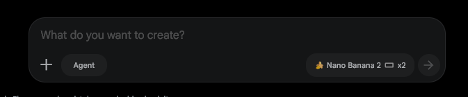
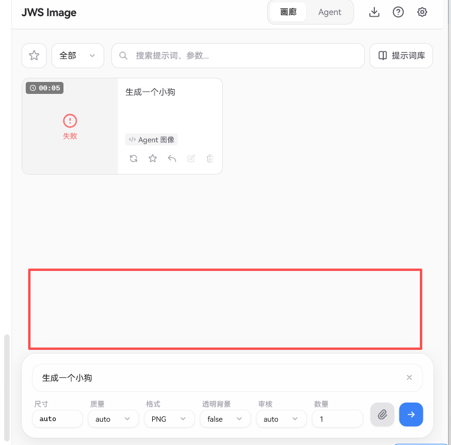
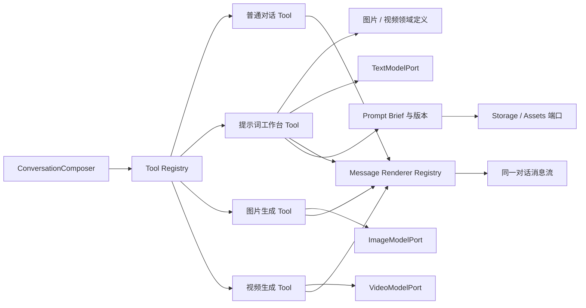
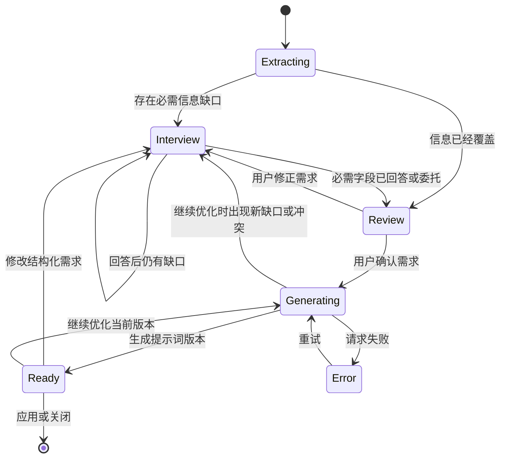

# 通用提示词访谈系统设计方案

## 1. 文档信息

- 暂定名称：提示词工作台（Prompt Studio）
- 文档状态：当前图片提示词范围已确认，视频保留为后续扩展参考
- 首个落地领域：图片生成提示词
- 后续领域：视频生成提示词
- 适用项目：`sub2Image`

## 2. 背景

当前期望不再是让文本模型对一句描述做单次润色，而是让模型像 Codex 执行任务一样，通过多轮、精确的访谈逐步确认需求。当关键信息确认完成后，系统生成一份完整提示词，用户可以直接编辑、继续要求模型修改、保存版本，最终再应用到具体的图片或视频输入框。

这套能力不能只绑定当前图片输入框。它需要能够从任意输入框、任意一条消息、当前对话分支、历史生成任务或外部粘贴内容启动，并把结果写回不同的业务目标。

因此，本方案将它设计为独立的“创作提示词访谈系统”，而不是某个组件内部的“优化描述”按钮。

## 3. 目标

### 3.1 产品目标

1. 模型主动识别信息缺口，并持续提出准确、与当前任务相关的问题。
2. 用户不需要一次写完专业提示词，可以通过问答逐步完成创作需求。
3. 信息确认后展示完整提示词，用户可以手动编辑并继续让模型优化。
4. 同一份提示词项目保留问答、结构化需求和版本历史，刷新页面后仍能继续。
5. 任意业务组件都能用很少的接入代码打开提示词工作台。
6. 图片和视频共用访谈、存储、版本、模型请求与 UI，只替换领域定义。
7. 可以将图片提示词项目转换成视频项目，继承主体、场景、风格和参考素材。

### 3.2 工程目标

1. 不复制现有 Agent 的大体量会话、分支和图片工具执行逻辑。
2. 复用现有文本模型配置、API URL、代理、超时和鉴权能力。
3. 访谈状态不能只存在于模型聊天文本中，必须有结构化 Brief 作为事实来源。
4. 领域规则与通用会话核心分离，新增领域时不修改访谈主流程。
5. 来源和应用目标通过协议接入，不让提示词工作台依赖 `InputBar` 或 `AgentWorkspace`。

## 4. 非目标

第一阶段不包含以下能力：

- 提示词工作台内部直接生成图片或视频。
- 自动评价最终生成图片是否满足提示词。
- 同一个提示词项目多人协作。
- 针对每一家图片或视频供应商编写独立访谈流程。
- 在没有用户确认的情况下覆盖原输入框内容。
- 让文本模型调用 `image_generation`、`generate_image` 等图片工具。

工作台负责把创作意图整理成可靠的提示词产物，实际生成仍由原有图片任务或未来视频任务负责。

## 5. 核心设计原则

### 5.1 对话不是唯一状态

聊天记录用于保留自然语言上下文，结构化 Brief 用于记录已经确认的事实。模型每轮回复都必须同时返回：

- 对 Brief 的增量修改。
- 下一批需要询问的问题，或者进入确认/完成阶段。
- 给用户看的自然语言消息。

如果只依赖聊天记录，模型容易重复询问、漏掉约束、错误覆盖用户决定，也难以判断视频领域的字段是否已经完整。

### 5.2 用户决定优先

用户明确给出的信息会被标记为锁定字段。后续模型可以提出修改建议，但不能静默改变。发生冲突时必须向用户确认。

### 5.3 多问，但只问相关问题

系统默认采用专业访谈模式，每轮询问 2～5 个相关问题。问题数量不是固定问卷，而是由当前领域、已有描述、参考素材和 Brief 缺口共同决定。

例如，人物摄影需要询问人物外观、动作、构图和光线，但不需要询问产品包装；单镜头视频不需要强制填写多镜头分镜表。

### 5.4 结果由用户确认

模型可以判断“必需字段已经覆盖”，但不能替用户判断“已经满意”。生成候选提示词后，用户仍可无限次：

- 手动修改。
- 继续提出修改要求。
- 返回需求清单修正某个字段。
- 恢复旧版本。
- 应用到来源输入框或其他目标。

### 5.5 标准产物与供应商格式分离

访谈首先生成供应商无关的标准提示词产物。后续如果需要适配 Kling、Veo、Sora 或其他模型，应增加渲染器，而不是让访谈过程直接绑定某个供应商的语法。

### 5.6 对话框与功能插件分离



用户标出的整个圆角输入区域定义为通用 `ConversationComposer`，包括：

- 文本编辑区。
- 附件入口和附件预览。
- 当前 Tool 模式按钮。
- 当前 Tool 的参数控件区域。
- 发送或停止按钮。

提示词工作台不是整个对话框，也不是独立弹窗或固定右侧面板。它是对话框中的一个 `ConversationTool`，当前与普通对话、图片生成平级；未来视频也以独立 Tool 接入。

启用提示词工作台 Tool 后：

- 原对话仍然显示，不跳转到另一套页面。
- 用户继续使用同一个输入框回答问题和上传图片。
- Tool 只向参数控件区域加入图片/视频领域等必要设置。
- 问题、需求确认和最终提示词通过专用消息块显示在上方对话流中。
- 关闭或切换 Tool 后，对话、草稿、附件和提示词项目都保留。

`ConversationComposer` 不包含提示词、图片或视频 API 调用。它只负责收集输入并把提交交给当前激活的 Tool。

### 5.7 开发期双轨验收



开发和验收阶段不直接替换底部原 `InputBar`。新 `ConversationComposer` 挂载在参考图红框区域，也就是旧输入框正上方；旧输入框始终保留为可用回退路径。该双输入框布局只是迁移期形态，不是最终产品设计。

- WP2 只开发 Runtime，不显示空壳或不可用占位框；从 WP3 开始，具备最小可操作能力后再挂载新 Composer。
- 新旧输入框通过接入适配器读取同一份现有草稿、附件和参数，便于逐项对照；点击哪个输入框的发送按钮，就只执行该输入框对应的一次提交，禁止双重请求。
- 全局 paste、drop、快捷键和焦点监听只归当前聚焦的 Composer，两个输入框不能同时响应同一事件。
- 页面底部避让高度按新旧两个输入框及其间距的总高度计算，消息、任务卡和移动端软键盘不能被遮挡。
- 在 Agent、图片生成、附件、mention、mask、桌面和移动端回归全部通过后，仍需用户明确验收；只有得到移除确认，才在发布收尾阶段删除旧 `InputBar`。

## 6. 总体架构



通用能力分为五层：

1. 对话框层：只管理输入、附件、工具栏槽位和发送状态。
2. Tool 层：普通对话、提示词、图片、视频各自处理提交。
3. 消息层：每个 Tool 注册自己的结果消息渲染器。
4. 端口层：文本、图片、视频模型分别通过独立端口调用。
5. 提示词领域层：管理访谈、Brief、版本以及图片/视频领域规则。

## 7. 用户使用流程

### 7.1 从输入框启动

1. 用户在图片输入框写入初步描述并添加参考图。
2. 点击“提示词工作台”按钮。
3. 系统读取文字、图片、尺寸、比例等现有上下文。
4. 模型先提取已知需求，再询问缺失信息。
5. 用户通过选项、自由输入或数值控件回答。
6. 必需字段覆盖后进入“需求确认”。
7. 用户确认后生成完整提示词。
8. 用户编辑或继续优化。
9. 点击“使用此提示词”，写回输入框并切换到图片 Tool；用户检查后再次发送才生成。

### 7.2 从对话启动

对话输入区底部工具栏固定提供“提示词工作台”模式按钮。点击后选择图片或视频领域，后续问题、确认和结果都进入当前对话消息流。

对话消息菜单还提供两种指定来源入口：

- 基于此消息创建提示词。
- 基于当前对话创建提示词。

如果用户直接启用模式，默认读取当前对话激活路径；如果通过消息菜单启用，则只读取选择的消息及其附件。对话存在分支时不导入兄弟分支。工作台项目与当前对话建立关联，但后续修改不会改写原消息。

### 7.3 从历史任务启动

“历史任务”指图库中已经执行过的图片生成任务，不是普通聊天记录。图片任务详情和菜单可以提供“继续优化提示词”：

- 导入任务实际使用的提示词。
- 导入输入参考图。
- 可选导入生成结果作为新的视觉参考。
- 保留模型、比例和生成参数作为上下文。

生成结果不会默认导入。用户选择结果图后，工作台把它作为“需要分析或改进的结果图”，结合原提示词询问哪些部分需要保留、哪些部分需要修正。

### 7.4 图片项目转视频项目

用户可以从完成的图片项目选择“创建视频版本”。系统继承：

- 主体与身份特征。
- 场景和时代背景。
- 视觉风格、色彩和光线。
- 参考图片关系。
- 必须保留和禁止出现的内容。

随后只继续询问视频特有字段，例如时长、动作过程、运镜、首尾状态、声音和连续性。

### 7.5 在访谈中上传图片

提示词工作台的问答输入区支持随时上传、替换和删除图片。上传图片只交给具备视觉理解能力的文本模型分析，不会触发图片生成。

图片可以承担以下角色：

- 主体或人物身份参考。
- 商品外观参考。
- 视觉风格参考。
- 构图或镜头参考。
- 视频首帧或尾帧参考。
- 需要分析和改进的历史生成结果。

如果用户没有说明图片用途，模型不能自行假定，必须在下一轮询问图片希望保留什么、允许改变什么。用户确认后，将图片角色和保留强度写入 Brief。

访谈过程中新增或删除图片后，系统重新检查所有依赖该素材的字段。删除素材不能静默保留与它相关的主体一致性、构图或首尾帧要求。

使用图片分析要求当前文本模型支持视觉输入。如果接口明确返回不支持图片，界面显示真实错误并引导用户更换文本模型，不通过猜测式降级继续分析。

## 8. 通用接入协议

### 8.1 通用对话框

`ConversationComposer` 是蓝框区域对应的唯一输入组件。它通过配置接收 Tool，不直接了解提示词、图片或视频业务：

```tsx
<ConversationComposer
  conversationId={conversation.id}
  tools={conversationTools}
  messages={messages}
  onAppendMessage={appendMessage}
/>
```

对话框核心只负责：

- 文本草稿与光标。
- 附件选择、排序和删除。
- 当前 Tool 的选择与参数控件槽位。
- 发送、停止和基础错误状态。
- 键盘、移动端和无障碍交互。

### 8.2 Tool 协议

```ts
interface ConversationTool {
  id: string
  label: string
  load: () => Promise<ConversationToolModule>
}

interface ConversationToolModule {
  Controls?: ComponentType<ConversationToolControlsProps>
  messageRenderers: Record<string, ComponentType<ConversationMessageProps>>
  validate(input: ConversationSubmitInput): string | null
  submit(
    input: ConversationSubmitInput,
    ctx: ConversationToolContext,
    signal: AbortSignal,
  ): Promise<void>
  stop?(ctx: ConversationToolContext): void
}

interface ConversationSubmitInput {
  text: string
  attachments: ConversationAttachment[]
  params: Record<string, unknown>
}
```

每个 Tool 只能控制三部分：

- 自己在工具栏里的参数控件。
- 自己的提交处理。
- 自己产生的消息类型如何渲染。

Tool 不能重写对话框基础输入、附件和发送按钮，也不能直接修改其他 Tool 的状态。

### 8.3 Tool 注册

```ts
const conversationTools = [
  createChatTool({ textModel }),
  createPromptStudioTool({ textModel, storage, assets, domains }),
  createImageGenerationTool({ imageModel }),
]
```

只允许一个主要 Tool 处于激活状态，避免同一次发送同时触发提示词访谈和图片生成。附件、复制、语音输入等不改变提交语义的功能属于通用操作，不占用主要 Tool。

当前版本只注册以上三个 Tool。未来视频需求确认后，再追加 `createVideoGenerationTool({ videoModel })`，不修改 Composer 协议。

新增功能时注册一个 Tool，不修改 `ConversationComposer` 内部判断。禁止在对话框中持续增加 `if (mode === 'image')`、`if (mode === 'video')` 分支。

### 8.4 提示词工作台 Tool

提示词工作台 Tool 激活时，从当前对话上下文构造统一来源：

```ts
interface PromptStudioSource {
  type: 'text' | 'conversation' | 'task' | 'project'
  id?: string
  title?: string
  text?: string
  messages?: PromptSourceMessage[]
  assets?: PromptSourceAsset[]
  metadata?: Record<string, string | number | boolean>
}

interface PromptSourceMessage {
  id?: string
  role: 'user' | 'assistant'
  content: string
  createdAt?: number
}

interface PromptSourceAsset {
  id: string
  type: 'image'
  dataUrl: string
  label: string
  role?: 'subject' | 'style' | 'composition' | 'start-frame' | 'end-frame' | 'unknown'
}
```

第一阶段只需要支持图片附件，接口保留 `type` 便于后续增加音频或视频片段。

提示词工作台 Tool 内部管理访谈状态、Brief、版本和持久化。它不控制对话框布局，只通过 `ctx.appendMessage()` 添加问题、确认或最终提示词消息。

### 8.5 消息渲染协议

```ts
interface ConversationMessage {
  id: string
  role: 'user' | 'assistant'
  kind: string
  content: string
  payload?: unknown
  createdAt: number
}
```

各 Tool 使用命名空间消息类型，避免冲突：

- `chat/text`。
- `prompt-studio/question`。
- `prompt-studio/review`。
- `prompt-studio/result`。
- `image-generation/result`。
- `video-generation/result`。

对话消息列表通过 renderer registry 找到对应组件。未知类型回退为普通文本或明确显示无法渲染，不在核心消息组件里增加所有业务分支。

### 8.6 模型调用端口

```ts
interface TextModelPort {
  respond(input: TextModelRequest, signal: AbortSignal): Promise<TextModelResponse>
}

interface ImageModelPort {
  generate(input: ImageModelRequest, signal: AbortSignal): Promise<ImageModelResult>
}
```

当前版本冻结 `TextModelPort` 和 `ImageModelPort` 两个模型端口。不设计一个包含所有类型的 `callApi(type, params)` 万能方法。文本和图片返回结构、流式事件、超时与任务恢复方式不同，强行合并会形成大量条件分支。

两个端口可以复用底层 URL、鉴权和 `fetch` 工具，但保持独立的请求与响应类型。Tool 只依赖自己需要的端口。未来实现视频时新增独立 `VideoModelPort`，不提前创建未使用的视频接口。

### 8.7 Tool 生命周期

- Tool 模块首次激活时动态加载。
- 同一个对话中，Tool 状态按 `conversationId + toolId` 保存。
- 切换 Tool 不清空草稿和兼容附件。
- 附件与新 Tool 不兼容时先提示用户确认，不静默删除。
- 每个运行请求拥有独立 `AbortController`。
- 切走 Tool 时可以继续后台任务，但 UI 必须显示运行状态并允许停止。
- Tool 卸载时清理订阅、对象 URL 和未使用的临时资源。

## 9. 项目数据模型

### 9.1 提示词项目

```ts
interface PromptProject {
  id: string
  conversationId?: string
  domain: PromptDomain
  title: string
  source: PromptStudioSourceSnapshot
  brief: PromptBrief
  messages: PromptStudioMessage[]
  pendingConflicts: PromptFieldConflict[]
  versions: PromptVersion[]
  activeVersionId?: string
  phase: PromptStudioPhase
  schemaVersion: 1
  createdAt: number
  updatedAt: number
}

type PromptDomain = string

interface PromptFieldConflict {
  field: string
  current: PromptBriefField
  next: PromptBriefPatchEntry
  reason: 'locked-change' | 'dependency-change'
}

interface PromptStudioSourceSnapshot {
  type: 'text' | 'conversation' | 'task' | 'project'
  id?: string
  title?: string
  text?: string
  messages?: PromptSourceMessage[]
  assets?: PromptStoredAssetRef[]
  metadata?: Record<string, string | number | boolean>
}

interface PromptStoredAssetRef {
  id: string
  type: 'image'
  label: string
  role?: 'subject' | 'style' | 'composition' | 'start-frame' | 'end-frame' | 'unknown'
  width?: number
  height?: number
}

type PromptStudioPhase =
  | 'extracting'
  | 'interview'
  | 'review'
  | 'generating'
  | 'ready'
  | 'error'
```

`conversationId` 用于自动恢复当前业务对话关联的项目。`source` 保存启动时的快照，不持续引用原业务对象，避免源消息删除或修改后破坏提示词项目。持久化快照只保存素材 ID 和描述信息，不保存 `dataUrl`。`pendingConflicts` 保存尚未确认的锁定字段和依赖冲突；普通 patch 不能清除它们，进入生成前必须逐项确认。`PromptDomain` 使用开放字符串，由领域注册表校验，核心不写死图片或视频联合类型。新建业务对话默认创建新项目，不自动混入其他对话的 Brief；全局项目列表后续再实现。

### 9.2 Brief

```ts
interface PromptBrief {
  domain: PromptDomain
  fields: Record<string, PromptBriefField>
}

interface PromptBriefField {
  value: PromptValue
  status: 'missing' | 'answered' | 'delegated' | 'not-applicable'
  origin: 'source' | 'user' | 'model'
  locked: boolean
  updatedAt: number
}

type PromptValue = string | number | boolean | Array<string | number | boolean> | null
```

字段状态说明：

- `missing`：当前缺失，需要判断是否提问。
- `answered`：用户或原始上下文已经明确给出。
- `delegated`：用户明确选择“交给模型决定”。
- `not-applicable`：根据当前任务判断不适用。

`origin` 用于在需求确认页区分用户决定与模型补充。用户明确回答后，字段设置为 `locked: true`。

### 9.3 会话消息

```ts
interface PromptStudioMessage {
  id: string
  role: 'user' | 'assistant'
  content: string
  questionIds?: string[]
  createdAt: number
}
```

结构化问题和 Brief 不嵌入消息正文，避免后续修改 UI 展示时影响事实数据。

### 9.4 版本

```ts
interface PromptVersion {
  id: string
  artifact: PromptArtifact
  source: 'model' | 'user'
  instruction?: string
  createdAt: number
}
```

以下行为创建新版本：

- 模型首次生成完整提示词。
- 用户要求模型继续修改并返回新结果。
- 用户手动编辑后主动保存。

仅在文本框中输入但尚未保存时，不立即创建版本。

恢复旧版本只切换 `activeVersionId`，不强制改变当前阶段。结构化需求已经被修改或重新出现缺口时，恢复旧文本不能绕过访谈和需求确认门禁。

## 10. 访谈状态机



### 10.1 提取阶段

首次启动时，模型从以下内容提取已有信息：

- 原始文本。
- 当前对话。
- 参考素材和引用标签。
- 业务传入的尺寸、比例、时长等元数据。

提取结果只能填入 Brief，不能直接把来源中没有表达的信息当成用户决定。模型推断的值必须标记为 `origin: 'model'`，并在需求确认页展示。

### 10.2 问题规划

客户端先根据领域定义计算：

- 尚未覆盖的必需字段。
- 当前条件下适用的可选字段。
- 已锁定、不能再次覆盖的字段。
- 用户已经委托模型决定的字段。

模型根据上述状态生成下一批问题。问题优先级为：

1. 会改变主体或核心意图的信息。
2. 会影响画面结构或视频时间线的信息。
3. 会影响风格、光线和镜头的信息。
4. 输出参数与限制条件。
5. 可以由模型合理决定的细节。

默认每轮 2～5 个问题。同一组问题应主题相关，避免在一轮中混合人物身份、文件格式和音效等跨度过大的内容。

### 10.3 精确回答

问题支持以下控件：

- 单选：互斥选项。
- 多选：可以组合的属性。
- 文本：开放描述。
- 数值：时长、数量等。

所有问题都支持：

- 自定义回答。
- 交给模型决定。
- 当前任务不适用。

“跳过”不能等同于空值。用户选择跳过时，需要明确记录为 `delegated` 或 `not-applicable`，否则系统无法可靠判断是否询问完成。

不提供“其余细节由模型补全”批量操作。用户可以在单个问题中回答“由你建议”，模型给出具体建议并继续在对话中确认。模型不能借此跳过后续访谈或直接执行生成。

### 10.4 图片分析

用户在访谈中上传图片后，下一次请求将图片作为 Responses API 的 `input_image` 发送，并携带稳定素材 ID。模型需要提取可观察信息，例如主体特征、服装、构图、光线、色彩和材质，但不能把推断内容直接标记为用户决定。

如果图片用途不明确，优先询问：

- 这张图用于参考什么。
- 哪些视觉特征必须保持。
- 哪些内容允许修改。
- 多张图片之间分别承担什么角色。

模型分析结果写入 Brief 时使用 `origin: 'model'`，用户确认后才改为锁定字段。

### 10.5 冲突处理

当新回答与锁定字段冲突时，模型返回冲突说明和确认问题。例如：

> 之前确认的是“夜晚雨景”，这次要求改成“正午阳光”。是否用新设定替换之前的时间和天气？

用户确认后才更新锁定字段。客户端不能通过字符串判断语义冲突，冲突由模型结合 Brief 和新回答识别，但最终更新仍通过结构化 `briefPatch` 完成。客户端检测到锁定字段覆盖或锁定依赖失效时，把冲突保存到 `pendingConflicts`；后续普通回答不能清除，过期或目标字段不匹配的确认也不能应用。

### 10.6 模糊概念消歧与调整追问

“高级感”“电影感”“更有氛围”“更震撼”“自然一点”等描述不能直接视为已经完成的视觉字段。模型必须把抽象概念拆成可以在画面或视频中执行、可以让用户判断的维度。

| 模糊描述 | 需要继续明确的维度示例 |
|---|---|
| 高级感 | 极简留白、奢侈品广告、杂志编辑风、材质表现、低饱和配色 |
| 电影感 | 画幅、镜头焦段、光比、色彩分级、颗粒、景深 |
| 更有氛围 | 时间、天气、光源、雾气、色温、环境密度 |
| 更震撼 | 景别、低机位、尺度对比、运动强度、剪辑节奏 |
| 自然一点 | 姿态、表情、光线、肤质、运动速度、镜头稳定程度 |

问题选项不能只使用多个同样模糊的形容词。每个选项需要描述可观察差异，例如不能只问“清新、电影、高级”，而应写成“低饱和冷色、强明暗对比、浅景深的夜景电影画面”。

用户调整任何已确认要求后，系统重新计算依赖字段：

1. 更新用户明确修改的字段。
2. 找出受影响的构图、光线、动作、时间线或输出字段。
3. 使已经不成立的模型补全值失效。
4. 对仍然存在歧义或冲突的内容继续提出 2～5 个精确问题。
5. 直到修改后的 Brief 再次完整、一致、可执行，才返回需求确认。

例如把“白天街道”改成“雨夜街道”后，需要重新确认或重新计算光源、色温、路面反射和人物服装状态；不能只替换“白天”为“雨夜”后直接生成。

如果用户针对某个问题回答“由你建议”，模型可以提出该字段的具体值，但必须在需求确认消息中展示，不能让模糊概念原样进入最终提示词。

### 10.7 需求确认

必需字段都处于 `answered`、`delegated` 或 `not-applicable`，且 `pendingConflicts` 为空后，进入需求确认页，展示：

- 用户已经明确决定的内容。
- 从来源对话中提取的内容。
- 交给模型决定的内容。
- 仍然可选但没有确认的内容。

用户可以点击任意字段返回修改，也可以输入补充说明。只有用户点击“生成完整提示词”后才进入生成阶段。

### 10.8 继续优化

进入 `ready` 后，用户可以输入修改要求。下一次请求必须同时发送：

- 当前 Brief。
- 当前编辑器中的实际文本，而不只是上一个模型版本。
- 用户本次修改指令。
- 已锁定字段列表。

这样用户手动修改的内容不会在下一轮模型优化时丢失。修改要求处理完成后仍要执行模糊概念消歧、冲突检查和依赖字段检查；如果出现新的信息缺口，继续询问，而不是强行返回最终提示词。

## 11. 模型返回协议

### 11.1 访谈响应

建议使用 Responses API 的结构化输出，响应只包含 JSON，不让 UI 从 Markdown 文本中猜测问题和提示词。

```ts
interface PromptInterviewReply {
  phase: 'interview' | 'review'
  message: string
  briefPatch: PromptBriefPatchEntry[]
  questions: PromptQuestion[]
}

interface PromptBriefPatchEntry {
  field: string
  value: PromptValue
  status: 'answered' | 'delegated' | 'not-applicable'
  origin: 'source' | 'user' | 'model'
  locked: boolean
}
```

示例：

```json
{
  "phase": "interview",
  "message": "主体已经明确，接下来确认构图和光线。",
  "briefPatch": [
    {
      "field": "subject",
      "value": "一名穿黑色风衣的成年女性",
      "status": "answered",
      "origin": "source",
      "locked": true
    }
  ],
  "questions": [
    {
      "id": "composition-shot",
      "field": "composition.shot",
      "text": "人物需要呈现什么景别？",
      "input": "single",
      "options": [
        { "label": "全身环境构图", "value": "full-shot" },
        { "label": "半身构图", "value": "medium-shot" },
        { "label": "面部特写", "value": "close-up" }
      ],
      "required": true
    }
  ]
}
```

### 11.2 产物响应

```ts
interface PromptArtifact {
  domain: PromptDomain
  title: string
  prompt: string
  negativePrompt?: string
  params: Record<string, string | number | boolean>
  shotList?: PromptShot[]
}

interface PromptShot {
  index: number
  duration?: number
  prompt: string
  audio?: string
}
```

图片通常返回 `prompt + negativePrompt + params`；视频可以额外返回结构化 `shotList`。

`PromptArtifact` 是核心和持久化使用的领域对象。固定 strict JSON Schema 的传输对象使用 `params: Array<{ name, value }>`，`negativePrompt` 和 `shotList` 使用 `null` 表达缺省，分镜的 `duration`、`audio` 同样使用 `null`；adapter 校验后再转换成上面的领域对象。这样 Schema 不随领域字段动态变化，所有对象都可以保持 `additionalProperties: false`。

### 11.3 协议校验

客户端只做必要校验：

- JSON 可以解析。
- `phase` 是允许值。
- 问题引用的字段存在于当前领域定义。
- `ready` 产物包含非空 `prompt`。
- `briefPatch` 不能静默覆盖锁定字段。

如果模型返回异常，不应增加大量猜测式兼容分支。记录原始响应到 `console.error`，界面提供“重试”和“复制原始响应”，便于根据真实日志修正模型提示或协议。

## 12. 领域定义

### 12.1 通用领域接口

```ts
interface PromptDomainDefinition {
  id: PromptDomain
  label: string
  fields: PromptFieldDefinition[]
  ambiguities?: PromptAmbiguityRule[]
  buildInstructions: (brief: PromptBrief) => string
  buildArtifactInstructions: (brief: PromptBrief) => string
  canInheritFrom: PromptDomain[]
}

interface PromptFieldDefinition {
  id: string
  label: string
  group: string
  required: boolean
  appliesWhen?: PromptFieldCondition
  dependsOn?: string[]
}

type PromptFieldCondition =
  | { field: string; op: 'equals' | 'not-equals' | 'includes'; value: PromptValue }
  | { field: string; op: 'present' }
  | { all: PromptFieldCondition[] }
  | { any: PromptFieldCondition[] }

interface PromptAmbiguityRule {
  terms: string[]
  fields?: string[]
  question: string
}
```

领域定义负责字段和规则，会话核心不应出现“镜头焦段”“视频时长”等具体业务判断。

### 12.2 公共字段

图片和视频可以共享：

| 分组 | 字段示例 |
|---|---|
| 目标 | 用途、受众、表达重点 |
| 主体 | 类型、数量、身份、外观、服装、关键特征 |
| 行为 | 动作、表情、交互对象 |
| 场景 | 地点、时代、时间、天气、环境元素 |
| 视觉 | 风格、媒介、真实程度、色彩、光线、材质 |
| 构图 | 景别、视角、主体位置、留白、焦点 |
| 参考 | 每个素材的用途和保留强度 |
| 文本 | 画面文字、语言、排版要求、Logo |
| 约束 | 必须保留、禁止出现、合规边界 |
| 输出 | 比例、尺寸、质量目标 |

并非所有公共字段都必须询问。领域定义提供基础必需项，模型结合具体任务决定可选字段是否适用。

### 12.3 图片领域字段

图片领域在公共字段基础上重点覆盖：

- 主体和数量是否准确。
- 静态动作、表情与视线方向。
- 构图、景别、机位和画面重心。
- 摄影焦段、景深或绘画媒介。
- 主光、辅光、轮廓光和色彩关系。
- 参考图分别承担人物、商品、风格还是构图参考。
- 需要生成的准确文字。
- 负面约束和输出比例。

### 12.4 视频领域字段

视频领域增加：

- 总时长、比例、分辨率、帧率、是否循环。
- 单镜头或多镜头，镜头数量和时间分配。
- 每个镜头的起始状态、动作过程和结束状态。
- 运镜类型、方向、速度、轨迹和缓动。
- 人物、商品、服装、场景的连续性。
- 动作速度、物理表现、环境动态。
- 场景、天气、光线或时间的变化。
- 首帧、尾帧和参考素材关系。
- 对白、口型、旁白、音乐、环境声和音效。
- 防闪烁、防变形、防身份漂移、防物体突然出现等视频约束。

### 12.5 领域继承

图片转视频时不复制最终图片提示词字符串，而是映射 Brief 公共字段。映射后：

- 公共字段保留原值和来源。
- 视频特有字段设为 `missing`。
- 图片专属且视频不适用的字段标记为 `not-applicable`。
- 用户可以重新确认参考图是首帧、风格参考还是人物参考。

## 13. UI 方案

### 13.1 桌面布局

下图描述最终验收通过后的单 Composer 布局。迁移期使用第 5.7 节的双轨布局：新 Composer 位于旧 `InputBar` 上方，旧输入框保持原位置和完整功能。

```text
┌────────────────────────── 对话消息区域 ──────────────────────────┐
│ 模型：请确认构图和光线                                           │
│ [全身环境构图] [半身构图] [面部特写]                             │
│                                                                 │
│ 用户：低机位，雨夜霓虹                                           │
│                                                                 │
│ 提示词结果消息                                                   │
│ ┌─────────────────────────────────────────────────────────────┐ │
│ │ 完整提示词，可直接编辑                                      │ │
│ │ [需求摘要] [继续修改] [复制] [应用] [生成]                  │ │
│ └─────────────────────────────────────────────────────────────┘ │
│                                                                 │
│ ┌──────────────────────── ConversationComposer ───────────────┐ │
│ │ 输入回答、创作要求或修改意见                                │ │
│ │ [+] [提示词工作台] [图片⌄]         [模型/比例/数量] [发送] │ │
│ └─────────────────────────────────────────────────────────────┘ │
└─────────────────────────────────────────────────────────────────┘
```

蓝框对应的整个圆角区域是 `ConversationComposer`。提示词工作台只是底部 Tool 模式按钮，不接管整个对话框。

输入区底部工具栏参考创作工具的 Agent 模式排列：

1. `+`：上传参考图片。
2. `提示词工作台`：启用或关闭模式。
3. 当前目标“图片提示词”；未来新增领域时通过 Tool/领域注册扩展，不在当前 UI 显示视频选项。
4. 当前生成目标或必要参数摘要。
5. 发送/停止按钮。

访谈问题、需求确认、最终提示词和图片结果都作为不同类型的消息显示在同一消息区域。最终提示词消息内部提供编辑和操作，不另外打开右侧工作台。未来视频结果沿用消息 renderer 协议。

### 13.2 移动端布局

移动端沿用同一个对话消息流和底部 `ConversationComposer`，不增加页面级工作台。工具栏空间不足时保留附件、当前 Tool 和发送按钮，领域、模型、比例和数量合并到参数菜单。

复杂的 Brief 和版本记录在对应消息中折叠显示，点击后在当前页面展开或进入底部面板，不替换整个对话。

### 13.3 问题交互

- 单选使用选项列表或分段控件。
- 多选使用复选框。
- 数值使用输入框或步进器。
- 每个问题保留自由输入入口。
- 问答输入区提供图片上传按钮，并展示图片缩略图、标签和当前用途。
- 新图片用途不明确时，下一轮先询问其参考角色和保留范围。
- 一轮多个问题统一提交，用户也可以只回答部分问题。
- 模型请求过程中支持停止。
- 失败时保留本轮答案，不要求用户重新填写。

### 13.4 结果交互

- 完整提示词使用可编辑文本区域。
- 图片负面提示词独立显示。
- 视频分镜使用按顺序排列的镜头列表。
- 手动修改后显示“未保存修改”状态。
- “继续优化”使用编辑器中的实时内容，不回退到旧版本。
- “应用”前不修改原业务输入框。

## 14. 现有项目接入

### 14.1 应用顶层

在 `src/App.tsx` 组合 `conversationTools`，将普通对话、提示词工作台和图片生成 Tool 注册给通用对话运行时。未来视频功能只需要追加视频 Tool。现有设置、确认框和其他弹窗不承担 Tool 内部状态。

迁移期由 `App.tsx` 同时挂载新 Composer 验收区和旧 `InputBar`。新 Composer 不嵌进旧组件内部，也不改变旧组件的提交入口；两者只通过受控草稿适配器共享必要状态。最终移除旧输入框必须是独立改动，不能夹在 Tool 或提示词业务工作包中顺带完成。

### 14.2 图片输入框

`src/components/InputBar.tsx` 当前已经同时承担编辑器、附件、图片参数和不同模式提交。实施时先将可复用的输入框外壳收敛为 `ConversationComposer`，现有图片生成功能通过 `sub2ImageImageTool` 接回原来的 `submitTask()`。

提示词工作台 Tool 的来源适配器负责：

- `source.type = 'text'`。
- `source.text` 使用去除内部标记后的可见提示词。
- `source.assets` 包含当前输入图片和 `@图N` 标签。
- `metadata` 包含比例、质量等当前参数。
- `onApply` 负责恢复引用标记并调用 `setPrompt()`。

入口位于输入区底部工具栏的附件按钮旁边。切换到提示词工作台后，Composer 本身不卸载，现有草稿、图片和参数保持不变。图片画廊模式没有消息列表时，在主内容区显示与当前提示词项目关联的访谈消息流；关闭 Tool 后恢复画廊。

结果提供“使用此提示词”按钮：把文本和引用写回输入框并切换到图片 Tool，不调用 `submitTask()`。用户检查参数后再次点击发送才生成。

### 14.3 Agent 对话

在 `src/components/AgentWorkspace.tsx` 增加：

- 复用同一个 `ConversationComposer` 和 Tool registry。
- 单条消息菜单入口。
- 当前对话菜单入口。

整段对话通过现有 `getActiveAgentRounds()` 获取当前分支，按轮次整理用户和助手消息，并收集当前路径实际引用的图片。

Agent 普通聊天由 `sub2ImageChatTool` 调用现有 `submitAgentMessage()`；提示词工作台由独立 Tool 处理。结果可以写入输入框，但不能自动提交，避免用户尚未检查提示词时触发其他 Tool。

### 14.4 历史图片任务

本入口不属于当前版本，仅作为后续扩展说明。

在任务卡片、详情弹窗或图片右键菜单中增加“继续优化提示词”，来源包含：

- `task.prompt`。
- `task.inputImageIds`。
- 任务实际使用的模型和参数。
- 用户选择时才包含生成结果图片。

### 14.5 未来视频组件

未来视频输入框只需要传入 `domain: 'video'`、当前文字、参考帧和视频元数据。提示词工作台不依赖具体视频组件。

## 15. 参考图和引用标记

当前图片输入框的 `@图N` 内部带有不可见选中标记，不能直接让模型处理后原样覆盖。

处理流程：

1. 创建来源时调用 `stripImageMentionMarkers()`，发给模型可见的 `@图N`。
2. 每张参考图使用稳定内部 ID，同时携带当前显示标签。
3. 模型上下文明确说明不得随意交换或删除引用关系。
4. Brief 单独记录每张参考图的用途，不只依赖提示词字符串。
5. 应用到图片输入框时，将仍然有效的 `@图N` 恢复为内部 mention 标记。
6. 如果引用图片已经删除，需求确认消息明确显示失效，不静默改指向其他图片。

图片顺序发生变化时，应通过图片 ID 重新计算标签，而不是长期保存固定的 `@图1` 字符串。

## 16. 文本模型调用

### 16.1 模型配置

第一阶段复用现有 Agent 文本模型：

- 使用 `getAgentTextApiProfile()` 获取配置。
- 未配置时打开设置中的 Agent 文本模型区域。
- 不新增第二套提示词模型配置。
- 后续有明确需求时再允许为工作台指定独立文本模型。

### 16.2 TextModel 端口

提示词 Tool 核心只调用 `TextModelPort`，不直接导入当前项目的 API 模块。功能包可以提供标准 `openAiResponsesTextModel`；当前项目则使用外部 `sub2ImageTextModel` 复用 API 配置、代理和鉴权。

`sub2ImageTextModel` 不能直接调用现有 `callAgentResponsesApi()`，原因是现有 Agent 请求会注册图片生成工具和 Agent 专用指令。

提示词工作台请求：

- 使用 Responses API。
- 不注册图片生成工具。
- 使用结构化输出约束 JSON。
- 支持 `AbortSignal`。
- 复用现有 API URL、代理、鉴权和超时工具。
- 请求失败时保留用户当前填写内容。

### 16.3 上下文发送

为保证刷新恢复和不同兼容服务行为一致，第一阶段每轮发送完整的必要上下文，而不是只依赖 `previous_response_id`：

- 当前领域规则。
- 来源摘要和附件。
- 当前完整 Brief。
- 当前仍有效的最近问答。
- 当前编辑版提示词。
- 本轮用户回答或修改要求。

会话过长后可以生成压缩摘要，但不能丢弃 Brief。Brief 始终完整发送。

### 16.4 模型指令重点

系统指令必须要求模型：

- 先提取已知信息，再询问缺口。
- 多问但不询问无关字段。
- 不重复询问已回答字段。
- 把抽象形容词拆成可观察、可执行的视觉或动态参数。
- 用户调整要求后重新检查所有依赖字段，有新歧义时继续提问。
- 不静默覆盖锁定字段。
- 不把推断伪装成用户决定。
- 图片用途不明确时先询问，不自行假定参考关系。
- 冲突时先确认。
- 提示词必须完整、自包含、可以直接交给生成模型。
- 不输出教学说明、Markdown 围栏或与协议无关的文字。
- 最终提示词保留用户语言，除非用户明确指定其他语言。

## 17. 持久化

提示词项目需要跨刷新恢复，但功能包不能直接依赖当前项目的 `db.ts`。所有持久化通过 `PromptStudioStorage` 端口完成。

当前 `sub2Image` 接入使用 `sub2ImageStorage` 沿用现有 Agent 会话的数据库：

1. 将 `src/lib/db.ts` 的 `DB_VERSION` 从 `4` 升级到 `5`。
2. 新增 `promptProjects` object store，使用 `id` 作为 keyPath。
3. 新增读取、写入、删除和替换项目方法。
4. `sub2ImageStorage` 把这些方法实现为功能包要求的 storage 端口。
5. 项目列表、加载状态和当前会话由提示词 Tool 的作用域 store 管理，不写入当前项目的 `store.ts`。
6. Brief 合并、问题规划和领域逻辑全部保留在功能包 `core/`。

复制到其他项目时，可以改用功能包自带的独立 IndexedDB storage，也可以实现服务端 storage，不需要修改会话核心和 UI。

参考图片不重复保存完整 data URL。持久化来源时优先记录现有图片 store ID，需要发送请求时通过 `ensureImageCached()` 获取。外部临时粘贴图片则先写入现有图片存储。

项目删除时，由 `PromptStudioAssets.deleteIfUnused()` 处理素材清理。`sub2ImageAssets` 需要检查图片是否仍被任务、Agent 会话、输入草稿或其他提示词项目引用，再决定是否删除图片数据。

## 18. 建议文件结构

### 18.1 两层目录

采用“通用对话框 + 独立 Tool + 当前项目接入层”结构：

```text
src/
  features/
    conversationComposer/                 # 蓝框对应的通用对话框
      index.ts                            # 唯一公共入口
      types.ts
      components/
        ConversationComposer.tsx
        ConversationAttachments.tsx
        ConversationToolPicker.tsx
        ConversationToolControls.tsx
        ConversationSubmitButton.tsx
      hooks/
        useConversationRuntime.ts
      runtime/
        createConversationRuntime.ts
        toolRegistry.ts
        requestControllers.ts
      styles/
        conversationComposer.css
      tests/
        toolRegistry.test.ts
        boundary.test.ts
    conversationView/                     # 与输入框分离的消息流
      index.ts
      components/
        ConversationView.tsx
      runtime/
        messageRendererRegistry.ts
      tests/
        messageRendererRegistry.test.ts
        boundary.test.ts
    promptStudio/                         # 可整体复制的提示词 Tool
      index.ts
      types.ts
      createPromptStudioTool.ts
      store/
        createPromptStudioStore.ts
      messages/
        PromptQuestionMessage.tsx
        PromptReviewMessage.tsx
        PromptResultMessage.tsx
        PromptHistoryMessage.tsx
      core/
        session.ts                        # 状态机
        brief.ts                          # Brief 合并、锁定、完成度
        questions.ts                      # 问题校验、依赖重检
        versions.ts                       # 版本创建与恢复
        source.ts                         # 来源标准化
      domains/
        image.ts                          # 图片字段与指令
        video.ts                          # 后续扩展，不在当前版本创建
        shared.ts                         # 图片、视频公共字段
      ports/
        textModel.ts                      # 文本模型请求接口
        storage.ts                        # 项目持久化接口
        assets.ts                         # 素材保存与读取接口
      adapters/
        openAiResponsesTextModel.ts       # 可选标准 Responses 实现
        indexedDbStorage.ts               # 可选独立 IndexedDB 实现
        indexedDbAssets.ts                # 可选独立图片素材实现
      styles/
        promptStudio.css                  # 自包含样式和主题变量
      tests/
        brief.test.ts
        questions.test.ts
        session.test.ts
        boundary.test.ts
    imageGeneration/                      # 图片生成 Tool，与对话框解耦
      index.ts
      createImageGenerationTool.ts
      ports/
        imageModel.ts
      messages/
        ImageResultMessage.tsx
    videoGeneration/                      # 后续扩展，不在当前版本创建
      index.ts
      createVideoGenerationTool.ts
      ports/
        videoModel.ts
      messages/
        VideoResultMessage.tsx
  integrations/
    conversation/                         # sub2Image 专用组合，不随功能包复制
      conversationTools.ts                # 注册聊天、提示词、图片、视频 Tool
      sub2ImageTextModel.ts                # 复用文本模型配置、代理和鉴权
      sub2ImageImageModel.ts               # 接入现有图片 API
      sub2ImageStorage.ts                 # 接入 src/lib/db.ts
      sub2ImageAssets.ts                  # 接入现有图片存储和缓存
      gallerySource.ts                    # 图片输入框来源与写回
      agentSource.ts                      # Agent 当前分支来源与写回
      taskSource.ts                       # 后续历史任务入口，不在当前版本创建
      promptMentions.ts                   # @图N 内部标记转换
  App.tsx
  store.ts
  types.ts
```

`conversationComposer` 是稳定的通用外壳，`promptStudio`、`imageGeneration` 和 `videoGeneration` 是相互独立的 Tool。每个功能目录的共享类型保留在自己的 `types.ts`，不写入根目录 `src/types.ts`。只有 `sub2Image` 业务本身使用的接入类型才放根目录类型文件。

### 18.2 硬边界

`src/features/conversationComposer/` 只允许依赖 React 和自身模块，不能依赖任何具体 Tool。

`src/features/conversationView/` 只依赖 Composer 对外导出的消息和 Tool 协议，不依赖具体 Tool。Tool renderer 通过 registry 注入。

`src/features/promptStudio/` 只允许依赖：

- React。
- `conversationComposer` 对外导出的 Tool 与消息协议。
- 功能包内部模块。
- 明确列入功能包依赖的第三方库。

它不能直接导入：

- `src/store.ts`。
- `src/types.ts` 中的业务类型。
- `src/lib/db.ts`。
- `src/lib/apiProfiles.ts`。
- `src/lib/agentApi.ts`。
- `InputBar`、`AgentWorkspace`、`TaskCard` 等业务组件。
- 项目全局图片缓存和 mention 实现。
- 项目根目录的 `index.css` 或 Tailwind 专用工具类。

图片和视频 Tool 同样不能反向依赖对话框或当前项目的内部实现，只使用公开 Tool 协议。所有项目相关能力必须通过 `ports/` 接口或 `integrations/conversation/` 转换。各功能目录的 `boundary.test.ts` 扫描源码，发现反向 import 时直接使测试失败。

### 18.3 提示词 Tool 的三个必要端口

提示词 Tool 只要求宿主提供三个端口：

```ts
interface TextModelPort {
  respond(input: TextModelRequest, signal: AbortSignal): Promise<TextModelResponse>
}

interface PromptStudioStorage {
  list(): Promise<PromptProject[]>
  get(id: string): Promise<PromptProject | null>
  getByConversationId(conversationId: string): Promise<PromptProject | null>
  put(project: PromptProject): Promise<void>
  delete(id: string): Promise<void>
}

interface PromptStudioAssets {
  save(asset: PromptSourceAsset): Promise<PromptStoredAsset>
  resolve(id: string): Promise<string | null>
  deleteIfUnused(id: string): Promise<void>
}
```

- `textModel` 决定使用哪个文本模型和 API。
- `storage` 决定项目保存在 IndexedDB、服务端还是内存。
- `assets` 决定上传图片如何保存和读取。

功能包不需要知道这些能力背后的具体实现。

### 18.4 唯一公共入口

宿主只能从各功能目录的 `index.ts` 导入，不允许深层引用内部文件。

`conversationComposer/index.ts`：

```ts
export { ConversationComposer } from './components/ConversationComposer'
export { createConversationRuntime } from './runtime/createConversationRuntime'
export type {
  ConversationMessage,
  ConversationTool,
  ConversationToolContext,
  ConversationToolModule,
} from './types'
```

`conversationView/index.ts`：

```ts
export { ConversationView } from './components/ConversationView'
export { createMessageRendererRegistry } from './runtime/messageRendererRegistry'
```

`promptStudio/index.ts`：

```ts
export { createPromptStudioTool } from './createPromptStudioTool'
export { imageDomain } from './domains/image'
export { createOpenAiResponsesTextModel } from './adapters/openAiResponsesTextModel'
export { createIndexedDbStorage } from './adapters/indexedDbStorage'
export { createIndexedDbAssets } from './adapters/indexedDbAssets'
export type {
  PromptArtifact,
  PromptDomainDefinition,
  PromptProject,
  PromptStudioSource,
} from './types'
export type { PromptStudioAssets } from './ports/assets'
export type { PromptStudioStorage } from './ports/storage'
export type { TextModelPort } from './ports/textModel'
```

这样内部目录可以重构，而所有接入方的 import 保持不变。

### 18.5 功能包配置

应用只在接入层组合 Tool：

```tsx
const promptStudioTool = createPromptStudioTool({
  textModel,
  storage,
  assets,
  domains: [imageDomain],
})

const tools = [
  chatTool,
  promptStudioTool,
  imageGenerationTool,
]

<ConversationComposer
  conversationId={conversation.id}
  tools={tools}
  messages={messages}
  onAppendMessage={appendMessage}
/>
```

视频接入已注册独立的 `videoDomain` 和视频提示词 Agent；图片与视频使用不同的 Prompt Studio conversation ID，提示词 Tool 仍只负责访谈、产物生成和写回 Composer，不直接调用视频 API。

提示词结果消息中的“应用”调用 ToolContext 把文本写回 Composer 草稿；“生成图片”则写入草稿并切换到图片生成 Tool。提示词 Tool 不直接调用图片或视频 API。

### 18.6 样式边界

为了能整体复制，通用对话框和各 Tool UI 不依赖当前项目的全局 Tailwind 类和 `src/index.css`。组件使用模块内样式，并通过 CSS 变量提供默认浅色、深色、边框和间距。

宿主可以覆盖变量调整视觉风格，但不覆盖也能正常显示。各功能包入口负责引入自己的样式，复制目录时不会漏掉必要样式。

当前 Prompt Studio 采用中性工作界面作为主体，只在 Tool 激活、AI 运行和答案选中状态使用液态高光，在结果标题和关键操作使用黑银 3D 金属层次。两类效果都必须有深色模式和减少动态效果回退，不能牺牲正文对比度或造成移动端溢出。

### 18.7 默认实现与项目实现

提示词 Tool 附带三个默认适配器，方便其他项目快速使用：

- 标准 OpenAI Responses text model。
- 使用独立数据库的 IndexedDB storage。
- 使用独立数据库的 IndexedDB assets。

`sub2Image` 不强制使用默认适配器。它通过 `src/integrations/conversation/` 复用当前项目已有的 API 代理、Agent 文本模型配置、图片 API、图片缓存和数据库。

### 18.8 将来提取为 npm 包

第一阶段不改成 monorepo，也不新增 npm workspace。先保证 `conversationComposer` 和各 Tool 的公开协议稳定。以后需要跨仓库使用时，可以分别平移到 `packages/conversation-composer`、`packages/prompt-studio-tool` 等目录，业务代码不需要重写。

### 18.9 拿来即用步骤

在同一个项目接入新的对话框：

1. 不复制功能包代码。
2. 先把 `ConversationComposer` 并行挂载在原输入框上方完成验收；验收通过并取得移除确认后，再替换原输入框外壳。
3. 传入已注册的 Tool 数组和当前对话上下文。
4. 为业务消息实现 append/update 适配。
5. 提示词、图片和视频能力自动出现在同一个 Tool 选择器中。

在另一个 React 项目复用：

1. 复制 `conversationComposer`。
2. 复制需要的 Tool，例如 `promptStudio`；不需要图片或视频时无需复制对应目录。
3. 使用默认端口实现或注入项目自己的模型、存储和素材端口。
4. 注册 Tool 并渲染 `ConversationComposer`。
5. 只从各功能包 `index.ts` 导入。

如果新增一个 Tool 仍需要修改 `ConversationComposer`，或者复制后必须修改其他 Tool 的内部代码，说明插件边界设计失败，应优先修正 Tool 协议或端口。

### 18.10 性能设计

- `ConversationComposer` 只维护草稿、附件引用和当前 Tool ID，不订阅完整提示词项目或生成任务列表。
- Tool 使用 `load()` 动态加载，未启用视频时不下载和执行视频 Tool 代码。
- 同一时间只渲染当前 Tool 的参数控件；其他 Tool 只保留轻量状态快照。
- Tool 状态使用作用域 store 和细粒度 selector，模型流式输出只更新对应消息，不重渲染整个输入框。
- 草稿输入保持本地状态，避免每次按键触发全局 store 更新。
- 图片和视频在 React 状态中只保存 ID、尺寸和缩略图 URL，不保存重复的大体积 base64。
- 长对话沿用消息虚拟化或可视区渲染，折叠不可见的复杂结果块。
- IndexedDB 写入合并和延迟执行，不在每个文本 delta 后落盘。
- 每个 Tool 拥有独立请求控制器，停止图片任务不会中止提示词访谈或视频任务。
- Tool registry 和消息 renderer registry 在初始化后保持稳定引用。

## 19. 实施阶段

### 阶段一：通用核心

- 完成独立 `ConversationComposer`。
- 定义 Tool、ToolContext 和消息 renderer 协议。
- 完成 Tool registry、动态加载、请求控制和作用域状态。
- 将现有普通对话与图片提交通过适配器接回，行为保持不变。
- 开发期把新 Composer 挂载在旧 `InputBar` 上方进行并行验收，不删除或禁用旧输入框。

完成标准：普通对话和现有图片生成可以作为两个 Tool 使用新 Composer，切换时不丢草稿和附件；旧 `InputBar` 仍可独立完成原有路径，两个输入框不会产生双重提交。

### 阶段二：提示词工作台 Tool

- 定义来源、Brief、问题、产物和项目类型。
- 完成纯文本 Responses API 和结构化输出。
- 完成会话状态机、字段锁定、冲突保护和版本。
- 完成 IndexedDB 项目持久化。
- 完成图片字段和领域指令。
- 完成问题、需求确认和最终提示词消息 renderer。
- 支持在工作台问答中继续上传和分析图片。
- 处理参考图和 `@图N`。

完成标准：从同一个 Composer 进入提示词 Tool，经过多轮访谈得到可编辑结果，并能应用到草稿或切换到图片生成 Tool。

### 阶段三：当前对话来源复用

- 接入 Agent 单条消息。
- 接入 Agent 当前分支。
- 按 conversationId 自动恢复当前对话关联项目。

完成标准：当前输入和 Agent 对话使用同一工作台，同一对话刷新后自动恢复项目。

### 后续阶段：历史入口、全局项目列表和视频

- 历史图片任务入口。
- 全局提示词项目列表。
- 视频字段、时间线、分镜和生成 Tool。

这些内容不属于当前版本，后续单独制定范围和验收标准。

## 20. 测试方案

### 20.1 纯逻辑测试

- 对话框边界测试禁止依赖任何具体 Tool。
- 各 Tool 边界测试禁止导入 `sub2Image` 业务模块。
- 注册新 Tool 不需要修改 Composer 源码。
- Brief 增量合并。
- 锁定字段不能被模型静默覆盖。
- `answered`、`delegated`、`not-applicable` 的完成度判断。
- 条件字段是否适用。
- dummy domain 扩展不需要修改访谈核心。
- 提示词版本创建和恢复。
- 来源对话当前分支整理。
- 图片引用 ID 与 `@图N` 的转换。
- 用户调整字段后的依赖字段失效与重新检查。
- 模糊概念不能直接满足具体字段。

### 20.2 API 测试

- 当前文本、图片端口拥有独立请求和响应类型。
- 切换 Tool 不会把请求发送到错误端口。
- 请求不包含任何图片生成工具。
- 请求包含完整 Brief 和本轮答案。
- 结构化访谈响应解析。
- 结构化产物响应解析。
- 非法 JSON、缺少字段和未知字段处理。
- 超时、中止和 HTTP 错误。
- 模型原始异常响应可以输出用于排查。

### 20.3 交互测试

- 输入框打开新项目。
- 切换普通对话、提示词和图片 Tool 时不重建 Composer。
- 切换 Tool 不丢失兼容的草稿、附件和参数。
- 输入区模式按钮、领域选择和附件按钮状态正确。
- 在访谈过程中上传、替换和删除图片。
- 图片用途不明确时继续询问。
- 一轮回答多个问题。
- 部分回答后继续追问。
- 交给模型决定。
- 冲突确认。
- 需求确认后生成。
- 手动编辑后继续优化不丢修改。
- 恢复旧版本。
- 应用前不修改原输入框。
- 关闭、刷新后恢复项目。
- 桌面和移动端无重叠、溢出和按钮位移。

## 21. 验收标准

### 21.1 通用性

- 任意对话组件可以使用同一个 `ConversationComposer` 并注册所需 Tool。
- 新接入点不需要复制模型调用、问答或持久化逻辑。
- 提示词、图片和视频 Tool 使用相同输入框，但拥有独立业务状态和 API 端口。
- 新增 Tool 不需要修改 Composer 内部源码。
- 工作台作为输入区中的模式按钮，不打开独立 Modal 或固定右侧面板。
- `src/features/promptStudio/` 不反向依赖当前项目业务模块，可以整体复制后通过三个端口运行。

### 21.2 访谈质量

- 模型先利用已有信息，不重复要求用户描述。
- 默认每轮提出 2～5 个有关联的问题。
- 抽象描述会被拆成具体视觉或动态维度，不以模糊概念结束访谈。
- 用户调整需求后会重新检查受影响字段并继续询问。
- 必需字段未处理时不能直接进入最终生成。
- 用户明确决定不会被后续模型静默改变。
- 冲突会向用户确认。
- 需求确认页能区分用户决定与模型补充。

### 21.3 结果质量

- 最终提示词完整、自包含、可编辑。
- 参考素材的用途明确。
- 用户手动编辑后继续优化不会丢失修改。
- 每次模型修改和用户保存都可以形成版本。
- 用户确认应用前不覆盖任何业务输入。

### 21.4 数据可靠性

- 刷新后项目、Brief、问答和版本可以恢复。
- 删除来源消息或任务后，项目快照仍然可用。
- 删除项目不会误删仍被其他业务使用的图片。

### 21.5 性能

- 未启用的视频或其他 Tool 不加载其业务模块。
- 输入文字时不重渲染完整消息列表和生成任务列表。
- 流式更新只刷新对应消息块，不刷新 Composer。
- Tool 切换后没有遗留监听器、对象 URL 或重复请求。
- 大图片和视频不以重复 base64 形式保存在 React 状态中。

## 22. 风险与处理

### 22.1 模型过度提问

处理方式：领域定义区分必需和可选字段；只有明显影响结果的可选字段才询问。用户可以对单个问题回答“由你建议”，但仍需在对话和需求确认消息中看到具体建议。

### 22.2 模型提问不足

处理方式：客户端根据领域定义检查必需字段，不完全依赖模型自行宣布完成。

### 22.3 模型修改用户要求

处理方式：锁定字段、结构化 patch 校验和冲突确认共同限制。

### 22.4 对话过长

处理方式：完整 Brief 始终保留；较旧消息压缩成摘要；最近问答和当前编辑版原文保留。

### 22.5 不同模型的 JSON 能力不同

第一阶段要求使用支持 Responses API 结构化输出的文本模型。真实出现兼容问题后，根据原始响应日志决定是否增加特定兼容方式，不预先编写大量猜测式解析。

### 22.6 通用设计导致首版过大

处理方式：先实现通用协议和图片领域的完整闭环。视频阶段先确定字段和继承协议，不在首版实现视频生成业务。

### 22.7 通用对话框变成巨型组件

处理方式：Composer 只提供固定槽位和 Tool 协议。新增业务必须注册 Tool 和消息 renderer，不允许向 Composer 添加领域判断。

### 22.8 万能 API 难以维护

处理方式：当前文本、图片分别使用强类型端口。未来视频新增独立端口，只复用底层鉴权、URL、超时和网络工具，不合并业务请求与响应。

## 23. 推荐默认决策

| 决策 | 推荐值 | 原因 |
|---|---|---|
| 产品名称 | 提示词工作台 | 不限制图片或视频，也能表达项目和版本能力 |
| 默认访谈强度 | 专业模式，每轮 2～5 问 | 满足精确、多问，同时避免一次出现过长表单 |
| 模型配置 | 复用 Agent 文本模型 | 避免重复设置 |
| 访谈图片 | 支持随时上传并分析 | 图片是创作意图的重要上下文，不能只在启动时添加 |
| 模糊描述 | 必须拆成具体维度并继续询问 | 防止“高级感”等词未经定义直接进入结果 |
| 用户调整 | 重新检查依赖字段并继续询问 | 防止局部修改造成需求自相矛盾 |
| 默认状态 | 提示词 Tool 关闭 | 只有用户主动开启后才执行提示词访谈 |
| 最终决定 | 用户确认和编辑最终提示词 | 模型只优化、建议和补充细节 |
| 细节补齐 | 在正常问答中逐项完成 | 不提供批量自动补齐并直接执行 |
| 对话框架构 | 通用 Composer + Tool registry | 当前对话、提示词和图片共用输入框但互不耦合 |
| 工作台位置 | 对话输入区中的 Tool 模式按钮 | 参考 Agent 工具模式，问答和结果留在原对话流 |
| API 边界 | 当前 Text/Image 两个端口 | 未来新增领域继续使用独立端口 |
| 代码边界 | 通用对话框 + 独立 Tool + 项目接入适配器 | 功能可单独复制，业务差异集中在 integrations |
| 首版来源 | 图片输入框、Agent 单条消息、Agent 当前分支 | 覆盖主要使用路径 |
| 首版领域 | 完整图片领域 | 先验证通用核心和访谈质量 |
| 视频 | 不在当前版本开发 | 只保证 Tool/领域协议没有写死图片 |
| 项目存储 | IndexedDB | 支持跨刷新恢复和长期版本 |
| 应用行为 | 写回并切换图片 Tool，用户再次发送 | 避免误生成和费用消耗 |
| 模型输出 | Responses API 结构化 JSON | 问题、Brief 和产物可稳定驱动 UI |

## 24. 当前范围确认

- 默认每轮询问 2～5 个问题。
- 用户调整要求后继续检查和询问，直到需求具体、一致、可执行。
- 不允许用未经定义的模糊概念结束访谈。
- 工作台对话中支持继续上传图片进行分析。
- 蓝框整个区域是通用对话框；提示词工作台是其中的 Tool 模式，不使用独立 Modal 或右侧工作台。
- 问题、需求确认和最终提示词都作为消息显示在同一对话流中。
- 提示词 Tool 默认关闭，只有用户主动开启后才运行。
- 细节在正常问答中逐项补齐，最终提示词由用户定夺。
- 不提供批量自动补齐或直接生成。
- 使用结果后切换到图片 Tool，由用户再次发送。
- 同一业务对话自动恢复关联项目；全局项目列表后置。
- 历史图片任务入口和视频不属于当前版本。
