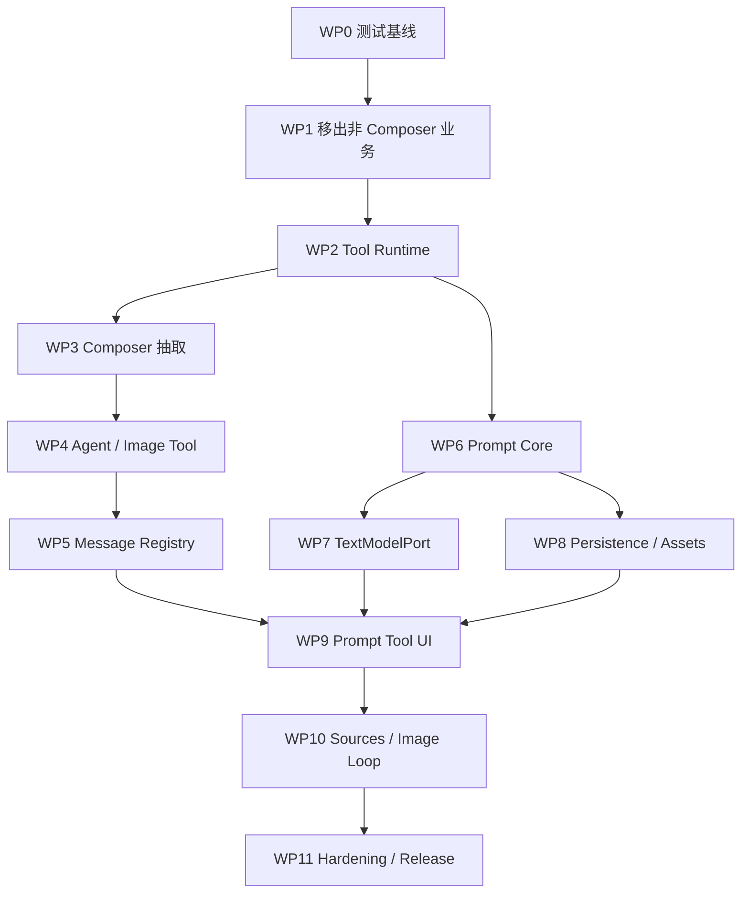

# 通用对话框与提示词工作台完整开发计划

## 1. 文档信息

- 关联设计：`docs/prompt-studio-design.md`
- 计划状态：当前范围已确认，可按工作包执行
- 制定日期：2026-07-16
- 首个完整领域：图片提示词
- 后续领域：视频提示词与视频生成，仅保留扩展能力，不纳入当前版本
- 交付方式：小步迁移，每个工作包可独立构建、测试和回滚

### 1.1 新会话交接要求

本计划必须作为独立事实来源，不能依赖制定计划时的聊天记忆。任何新的 Codex 会话开始开发前，按顺序读取：

1. 根目录 `AGENTS.md`。
2. `docs/prompt-studio-design.md`。
3. 本开发计划。
4. 下方视觉参考图和已确认产品决策。

如果聊天要求与文档不同，以用户最新要求为准，并立即同步更新文档，避免下一次会话继续使用旧决定。

### 1.2 视觉参考与准确解释


参考的是整块圆角输入区域的组织方式，不是复制 Google Flow 的品牌或视觉样式：

- 整个圆角区域是 `ConversationComposer`。
- 上半部分是文字编辑区。
- 左下角 `+` 是通用附件入口。
- `Agent` 对应当前激活的 Tool；本项目会显示普通对话、提示词工作台或图片生成。
- 右下区域是当前 Tool 的模型和参数摘要。
- 最右箭头是发送，运行中切换为停止。
- 提示词问题、用户回答和最终提示词显示在上方原对话消息流，不塞进这个紧凑输入区域。
- 不使用独立提示词弹窗或固定右侧工作台。

### 1.3 执行状态

实现者必须在开始和结束工作包时更新本表。只有该工作包全部测试门禁通过后才能标记为“已完成”，并在“验证证据”中记录实际执行的命令和结果。

| 工作包 | 状态 | 验证证据 |
|---|---|---|
| WP0 测试基线 | 已完成 | 2026-07-16：`npm run test:ci` 通过（build 590 modules；Vitest 23 files / 255 tests；E2E 10/10）；`npm run test:ui` 1 file / 2 tests；截图与 metrics：`docs/assets/prompt-studio-wp0/` |
| WP1 移出非 Composer 业务 | 待开始 | - |
| WP2 Tool Runtime | 待开始 | - |
| WP3 Composer 抽取 | 待开始 | - |
| WP4 Agent/Image Tool | 待开始 | - |
| WP5 Message Registry | 待开始 | - |
| WP6 Prompt Core | 待开始 | - |
| WP7 TextModelPort | 待开始 | - |
| WP8 Persistence/Assets | 待开始 | - |
| WP9 Prompt Tool UI | 待开始 | - |
| WP10 当前来源与图片闭环 | 待开始 | - |
| WP11 性能与发布收尾 | 待开始 | - |

状态只允许：`待开始`、`进行中`、`已完成`、`受阻`。标记“受阻”时必须写清阻塞条件和已经尝试的方案，不能用它代替未完成。

## 2. 最终目标

将用户标出的整个圆角输入区域建设为独立、通用、高性能的 `ConversationComposer`。当前版本让普通对话、提示词工作台和现有图片生成通过 Tool 插件接入同一个 Composer。视频只验证未来可以注册，不实现视频业务。

提示词工作台负责多轮精确访谈、图片分析、结构化 Brief、需求确认、完整提示词编辑和版本管理。它默认关闭，只有用户主动开启 Tool 后才运行。它不直接调用图片生成 API，而是把用户确认的结果应用到 Composer 草稿并切换到图片 Tool，最后由用户再次点击发送。

完成后必须满足：

1. 新增 Tool 不修改 `ConversationComposer` 内部业务判断。
2. 文本与图片使用独立强类型 API 端口，Tool 协议不阻碍后续视频扩展。
3. 普通 Agent 对话和现有图片生成行为无回归。
4. 提示词访谈默认每轮询问 2～5 个相关问题。
5. 模糊概念必须继续消歧，用户调整后重新检查依赖字段。
6. 问答、需求确认、最终提示词和图片结果都显示在同一消息流中。
7. Tool 切换不丢失兼容的草稿、附件和参数。
8. 未启用 Tool 不加载其业务模块，不参与渲染或请求。
9. 项目、Brief、版本和素材引用可以跨刷新恢复。
10. 桌面与移动端输入框不重叠、不溢出、不遮挡消息。

## 3. 已确认产品决策

| 决策 | 结果 |
|---|---|
| 蓝框区域 | 整个区域是通用 `ConversationComposer` |
| 提示词工作台位置 | Composer 工具栏中的 Tool 模式按钮 |
| 默认状态 | 关闭；普通对话和图片生成不经过提示词优化 |
| 启动条件 | 只有用户主动开启提示词 Tool 后才开始提取和追问 |
| 展示方式 | 问答和结果进入原对话消息流，不使用独立 Modal 或固定右侧面板 |
| 访谈强度 | 每轮 2～5 个相关问题 |
| 模糊要求 | 必须拆成可执行的视觉或动态参数 |
| 用户调整 | 重新检查受影响字段，有歧义继续追问 |
| 图片分析 | 访谈中可以继续上传、替换和删除图片 |
| 最终决定 | 模型只优化、补充和提供参考，最终提示词由用户确认和编辑 |
| 细节补齐 | 在正常多轮对话中逐项补齐，不提供批量自动补齐并直接生成 |
| 应用生成 | 应用结果后切换到图片 Tool，用户再次发送才生成 |
| 视频 | 当前不开发；未来作为独立 Tool 接入同一个 Composer |
| API 设计 | 当前使用 Text/Image 两个端口，不使用万能 `callApi(type)`；未来可新增 Video 端口 |
| 代码边界 | 通用 Composer、独立 Tool、项目接入适配器分层 |

## 4. 计划默认值

以下产品项尚未最终确认。为了让开发计划可以执行，暂按推荐值安排：

| 项目 | 计划默认值 |
|---|---|
| 历史图片任务入口 | 不进入第一版；作为后续入口扩展 |
| “其余细节由模型补全” | 不提供批量按钮；用户可以在单个问题中回答“由你建议” |
| 提示词项目恢复 | 第一版按对话自动持久化和恢复；全局项目列表后置 |
| 应用结果 | 写回草稿并切换图片 Tool，不自动提交，用户再次发送 |
| 视频 | 当前不实现领域、端口或 Tool，只用 dummy Tool 验证插件扩展性 |
| 结构化文本响应 | 首版非流式，完整响应后解析和持久化 |

上述范围已经按用户最新决定收敛。历史任务、全局项目列表和视频可以后续增加，不影响当前 Composer 和 Tool 架构。

### 4.1 两种“记忆”分别处理

开发交接记忆：由设计文档、开发计划和仓库内参考图保证。新开 Codex 会话不依赖聊天历史。

产品运行记忆：提示词项目通过 `conversationId` 关联并保存到 IndexedDB。重新打开同一个业务对话时自动恢复关联项目；新建业务对话默认创建干净项目，不自动混入旧对话需求。全局浏览和引用旧项目的“项目列表”作为后续功能，不影响第一版的同对话恢复。

## 5. 当前技术基线

### 5.1 代码规模

| 文件 | 当前规模 | 主要风险 |
|---|---:|---|
| `src/components/InputBar.tsx` | 2292 行 | 输入、附件、批量操作、参数、mention、遮罩、两种提交混合 |
| `src/components/AgentWorkspace.tsx` | 1246 行 | 分支消息、工具块、任务卡、编辑与重试混合 |
| `src/store.ts` | 5635 行 | 全局草稿、任务、Agent 会话、持久化和请求执行混合 |
| `src/lib/agentApi.ts` | 1003 行 | Agent 指令、文本、图片工具和 SSE 混合 |
| `src/lib/db.ts` | 345 行 | IndexedDB v4，事务完成和跨标签升级处理不足 |

### 5.2 当前关键调用链

```text
App.Workspace
├─ gallery -> TaskGrid
├─ agent   -> AgentWorkspace
└─ 始终挂载 InputBar
   ├─ gallery -> submitTask() -> executeTask()
   └─ agent   -> submitAgentMessage() -> executeAgentRound()
```

`InputBar` 目前只有一个实例，画廊和 Agent 共用全局 `prompt / inputImages / maskDraft`。模式切换、会话切换和编辑历史消息会隐式保存、恢复或覆盖这份草稿。迁移时必须保留这份协议，不能先创建第二套 Composer 状态。

### 5.3 当前测试基线

- Vitest 使用默认 Node 环境。
- 当前没有 React Testing Library、jsdom 正式配置或仓库级 Playwright 测试。
- 现有测试重点覆盖 store、Agent API、图片 API、引用、遮罩和恢复。
- 现有 store 测试把 DB mock 成 Map，不能验证真实 `DB_VERSION 4 -> 5` 升级。
- 计划制定时基线为 22 个测试文件、252 个测试通过。

## 6. 不可违反的架构边界

### 6.1 Composer 边界

`ConversationComposer` 只管理：

- 文本草稿与光标。
- 通用附件入口和预览槽。
- Tool 选择器。
- Tool 参数控件槽。
- 发送、停止和基础错误状态。
- 键盘、输入法、移动端和无障碍交互。

Composer 不得导入：

- Prompt Studio 业务。
- 图片或视频 API。
- `store.ts`。
- `InputBar`、`AgentWorkspace` 或任务组件。
- 图片、视频专用参数类型。

### 6.2 Tool 边界

每个 Tool 只能注册：

- ID、名称和懒加载入口。
- 工具栏参数控件。
- 输入校验。
- 提交和停止处理。
- 自己的消息 renderer。

同一时刻只允许一个主要 Tool 处理发送。附件、复制、语音输入等不改变提交语义的能力属于通用操作。

### 6.3 API 边界

```ts
interface TextModelPort {
  respond(input: TextModelRequest, signal: AbortSignal): Promise<TextModelResponse>
}

interface ImageModelPort {
  generate(input: ImageModelRequest, signal: AbortSignal): Promise<ImageModelResult>
}
```

当前版本只实现 Text 和 Image 两个端口。Tool 协议不能写死允许的 Tool ID 或领域，因此未来可以新增 `VideoModelPort`，但本期不创建未使用的视频接口和业务文件。两个现有端口只复用底层 URL、鉴权、代理、超时和 fetch 工具，不合并请求和响应。

### 6.4 数据边界

- Composer 草稿不保存完整任务或项目。
- Tool 状态按 `conversationId + toolId` 隔离。
- Prompt Project 只保存素材引用，不保存重复 `dataUrl`。
- 业务 store 不保存 Prompt Studio 的领域逻辑。
- 所有图片删除路径通过统一引用收集器判断。

## 7. 目标目录

```text
src/
  features/
    conversationComposer/
      index.ts
      types.ts
      components/
      runtime/
      hooks/
      styles/
      tests/
    conversationView/
      index.ts
      components/
        ConversationView.tsx
      runtime/
        messageRendererRegistry.ts
      tests/
    promptStudio/
      index.ts
      types.ts
      createPromptStudioTool.ts
      store/
      messages/
      core/
      domains/
      ports/
      adapters/
      styles/
      tests/
    imageGeneration/
      createImageGenerationTool.ts
      ports/
      messages/
  integrations/
    conversation/
      conversationTools.ts
      sub2ImageChatTool.ts
      sub2ImageTextModel.ts
      sub2ImageImageModel.ts
      sub2ImageStorage.ts
      sub2ImageAssets.ts
      gallerySource.ts
      agentSource.ts
      promptMentions.ts
```

`features/` 只能依赖公开协议和自身模块，`integrations/` 承担所有当前项目耦合。

## 8. 交付策略

采用渐进替换，不进行一次性重写：

1. 先补行为基线和测试设施。
2. 先把明显不属于输入框的批量操作移走。
3. 创建 Tool 协议，但仍调用原有提交函数。
4. 把现有 InputBar 包装成受控 Composer，保持 UI 和状态来源不变。
5. 普通 Agent 和图片生成通过 Tool 适配器运行稳定后，再加入提示词 Tool。
6. 最后完成图片提示词闭环、性能和发布收尾；历史来源、全局项目列表和视频留作后续工作包。

每个工作包必须满足：

- 可以单独构建。
- 可以单独测试。
- 不依赖下一个工作包才能恢复现有行为。
- 没有无法解释的 console error 或重复网络请求。
- 失败时可以只回滚当前工作包。

## 9. 工作包 0：锁定契约与建立基线

### 9.1 目标

在修改 UI 前锁定现有行为、数据协议和性能基线，建立后续阶段使用的自动化门禁。

### 9.2 开发任务

- 在设计文档中冻结 `ConversationTool`、`ConversationMessage`、Text/Image 两个 Model Port 和 Prompt Project v1 类型。
- 记录当前画廊提交、Agent 提交、停止、草稿切换、编辑轮次和附件 mention 行为。
- 增加测试依赖：`jsdom`、`@testing-library/react`、`@testing-library/user-event`、`fake-indexeddb`、`@playwright/test`。
- 保留现有 Node Vitest，组件测试按文件使用 jsdom，不全局切换环境。
- 增加 Playwright 配置、稳定 mock 路由和桌面/移动端基础 fixture。
- 增加 `test:unit`、`test:ui`、`test:e2e`、`test:ci` 脚本。
- 在 CI 部署前加入 build、Vitest 和关键 E2E 门禁。
- 记录 Vite 初始 chunk、Composer 输入时的渲染范围和 Agent 流式时的 IndexedDB 写入次数。

### 9.3 涉及文件

- `package.json`
- `package-lock.json`
- `vite.config.ts` 或独立 `vitest.config.ts`
- `playwright.config.ts`
- `.github/workflows/deploy.yml`
- `tests/e2e/`

不新增 lint 或 formatter 配置。

### 9.4 测试门禁

- 当前全部 Vitest 通过。
- 普通 Agent 文本消息 E2E 通过。
- 画廊图片提交流程 E2E 通过。
- 桌面 `1440x900` 和移动端 `390x844` 基线截图保存。

### 9.5 退出条件

任何后续工作包造成现有基线路径变化时，测试能够明确报错。

## 10. 工作包 1：移出非 Composer 业务

### 10.1 目标

先缩小 `InputBar` 职责，不触碰文本、附件和提交协议。

### 10.2 开发任务

- 新增 `GallerySelectionActionBar`。
- 将任务选择、收藏夹选择、批量下载、批量删除等逻辑从 `InputBar` 移出。
- 复用现有 `InputBatchBars`，由画廊工作区挂载。
- 保持按钮位置、禁用状态、确认框和 toast 文案不变。
- `InputBar` 不再订阅仅供批量操作使用的 tasks、收藏夹和筛选状态。

### 10.3 涉及文件

- `src/App.tsx`
- `src/components/InputBar.tsx`
- `src/components/input/inputBatchBars.tsx`
- 新增 `src/components/GallerySelectionActionBar.tsx`

### 10.4 测试门禁

- 批量选择、反选、收藏、下载、删除测试通过。
- 画廊和 Agent 输入框位置没有变化。
- Agent 流式更新时，批量操作状态不触发 InputBar 重渲染。
- `npm run build`、`npm test` 通过。

### 10.5 回滚点

该工作包只移动画廊批量操作，可以独立回滚，不影响 Composer 后续接口。

## 11. 工作包 2：建立 Conversation Tool Runtime

### 11.1 目标

在不接入现有 UI 的情况下完成通用 Tool 契约、registry 和请求生命周期。

### 11.2 开发任务

- 创建 `src/features/conversationComposer/`。
- 定义 `ConversationTool`、`ConversationToolModule`、`ConversationToolContext`。
- 定义 `ConversationSubmitInput`、通用附件引用和参数快照。
- 实现 Tool ID 唯一校验、注册、查询和懒加载缓存。
- 定义 Tool 提供消息 renderer 的公开协议，并完成独立 registry 原语。
- 实现按 `conversationId + toolId` 隔离的作用域状态。
- 实现每个请求独立的 `AbortController`、requestId 和迟到结果丢弃。
- 规定同一提交只路由到一个主要 Tool。
- 增加源码边界测试：Composer 不能导入任何具体 Tool 或业务模块。

### 11.3 首版最小 Tool 协议

```ts
interface ConversationTool {
  id: string
  label: string
  load: () => Promise<ConversationToolModule>
}

interface ConversationToolModule {
  Controls?: ComponentType<ConversationToolControlsProps>
  messageRenderers: Record<string, ComponentType<ConversationMessageProps>>
  validate(input: ConversationSubmitInput): string | null
  submit(input: ConversationSubmitInput, ctx: ConversationToolContext, signal: AbortSignal): Promise<void>
  stop?(ctx: ConversationToolContext): void
}
```

首版不加入用不到的生命周期钩子。出现真实需求后再扩展协议。

### 11.4 测试门禁

- 重复 Tool ID 拒绝注册。
- 未知 Tool、加载失败和重试行为明确。
- Tool 只在首次激活时加载，同一模块只加载一次。
- 一次发送只调用当前 Tool。
- 停止 Tool A 不影响 Tool B。
- 中止后的迟到结果不能追加消息。
- 新增 dummy Tool 不修改 Composer 源码即可工作。
- boundary test 通过。

### 11.5 退出条件

Runtime 可以在纯测试环境中运行普通文本、模拟图片和任意 dummy Tool，证明新增类型不需要修改核心。

## 12. 工作包 3：抽取受控 ConversationComposer

### 12.1 目标

将蓝框 UI 抽成纯 props 组件，但第一轮仍使用现有 Zustand 草稿和现有提交路径，确保零行为变化。

### 12.2 开发任务

- 从 `InputBar` 抽取 `ConversationComposer` 外壳。
- 抽取 `ComposerEditor`，保留当前 contentEditable、光标和中文输入法行为。
- 建立附件槽、Tool 模式槽、参数控件槽和提交按钮槽。
- 暂时由 `InputBar` 适配现有 `prompt / inputImages / maskDraft / params`。
- 当前 `@图N`、Agent 轮次图片 mention、遮罩和排序逻辑仍留在 integration。
- 将全局 paste/drop 监听限制到明确的活动 Composer，避免未来多个 Composer 抢事件。
- Composer DOM 在 Tool 切换时不卸载，保留焦点、光标和草稿。
- 样式先保持现状，不在该工作包重做视觉设计。

### 12.3 通用与业务边界

通用 Composer 包含：

- 文本输入和基础键盘处理。
- 通用附件 UI。
- Tool 和参数槽。
- 发送/停止按钮。

integration 保留：

- `@图N` 的隐藏标记转换。
- mask 规则。
- 图片参数兼容。
- API 配置校验。
- 画廊和 Agent 草稿同步。

### 12.4 测试门禁

- 中文输入法组合期间 Enter 不提交。
- Enter、Shift+Enter、项目现有提交快捷键行为一致。
- Tool 切换不卸载编辑器，不丢焦点和选区。
- 上传、粘贴、拖放、替换、排序图片行为一致。
- `@图N` 选择、移动和删除后映射正确。
- mask 第一张图片和替换规则保持不变。
- 桌面、移动端和横屏截图无变化或只有已批准差异。
- `npm run build`、`npm test`、Composer E2E 通过。

### 12.5 回滚点

保留原 `InputBar` 适配层。出现问题时可以让它继续渲染旧内部结构，不影响 Tool Runtime。

## 13. 工作包 4：接入现有 Agent 与图片 Tool

### 13.1 目标

先证明同一个 Composer 可以稳定承载现有两种业务，再接提示词工作台。

### 13.2 开发任务

- 新增 `sub2ImageChatTool`，薄封装 `submitAgentMessage()` 和 `stopAgentResponse()`。
- 新增 `sub2ImageImageTool`，薄封装 `submitTask()` 和现有图片参数控件。
- 将 `InputParamsPanel` 作为图片 Tool 的 Controls。
- Tool 自己提供 placeholder、canSubmit、validationError、submit 和 stop。
- 移除 Composer 对 `appMode`、apiKey 和图片参数的判断。
- 新增原子命令 `loadComposerDraft()` / `applyComposerDraft()`，统一处理文字、附件、mask 和 mention。
- Agent 编辑历史轮次、任务复用和未来提示词应用都调用这个命令，不再分别调用多个 setter。
- 第一阶段保留 `executeTask()` 和 `executeAgentRound()`，不改请求执行核心。

### 13.3 独立中止补强

现有图片 API 的 `CallApiOptions` 没有完整外部 `AbortSignal` 链路。要宣称 Tool 可以独立停止，必须：

- 为 OpenAI 图片、fal、自定义服务商和轮询调用传递外部 signal。
- 区分用户停止、超时和接口失败。
- 确保停止后迟到结果不覆盖任务状态。
- 保持 Agent 当前整轮停止语义，后续再细化到单工具任务。

### 13.4 测试门禁

- 画廊提交仍创建相同 TaskRecord。
- Agent 提交仍创建相同 Round/Message 和分支关系。
- 配置错误打开正确设置页。
- mask 全覆盖确认流程一致。
- 切换画廊、Agent、会话和编辑轮次时草稿一致。
- 停止图片 Tool 不影响 Agent 或提示词模拟请求。
- 图片 API 外部 signal 到达实际 fetch/轮询。
- 原有 store、API、Agent API 测试全绿。

### 13.5 退出条件

普通 Agent 与图片生成已经完全通过 Tool registry 进入同一个 Composer，用户行为与迁移前一致。

## 14. 工作包 5：消息 Renderer Registry

### 14.1 目标

让提示词和图片能够在同一对话流显示不同结果，并为未来 Tool 保留 renderer 注册能力，但不重写现有 Agent 分支模型。

### 14.2 开发任务

- 将消息列表定义为独立 `ConversationView`，不放入 Composer 目录。
- 定义带命名空间的消息 kind。
- 将 `getAgentAssistantBlocks()` 提取成可测试的块映射。
- 为现有 Agent 文本、Web Search、图片工具、批量图片和错误状态注册 renderer。
- 保留 `getActiveAgentRounds()`、activeMessages、删除、重试和分支切换逻辑。
- 未知消息类型回退为普通文本或明确错误消息。
- Prompt Studio 暂时注册模拟 question/review/result renderer 验证扩展性。

### 14.3 消息类型

```text
chat/text
agent/web-search
agent/image-task
prompt-studio/question
prompt-studio/review
prompt-studio/result
image-generation/result
video-generation/result
```

### 14.4 测试门禁

- 现有 Agent 文本、搜索、单图、批量图、失败、停止显示一致。
- 分支切换只渲染激活路径。
- 删除或重试轮次不会留下孤立 Prompt 消息。
- 未知消息不会导致整个对话崩溃。
- 新 renderer 注册不修改通用消息列表源码。

## 15. 工作包 6：Prompt Studio 纯核心

### 15.1 目标

先完成不依赖 React、Zustand 和网络的访谈状态机，再连接 API 和 UI。

### 15.2 开发任务

- 定义 Prompt Project、Brief、Field、Question、Version、Artifact。
- 明确运行时 `PromptSourceAsset` 与持久化 `PromptStoredAssetRef`。
- 实现来源标准化和快照。
- 实现 Brief patch 合并、字段锁定和来源标记。
- 实现 `answered / delegated / not-applicable` 完成度。
- 实现条件字段、依赖字段失效和重新询问。
- 实现冲突确认。
- 实现每轮 2～5 个问题限制。
- 实现模糊概念消歧规则。
- 实现需求确认门禁。
- 实现模型版本、人工版本和旧版本恢复。
- 领域通过 `PromptDomainDefinition` 注册，核心不写死 `'image' | 'video'` 联合类型。
- 创建稳定 JSON Schema，不根据每次领域内容动态生成不同 schema。

### 15.3 图片领域 v1

至少覆盖：

- 用途和表达目标。
- 主体、数量、身份、外观、服装、动作、表情。
- 场景、时代、时间、天气和环境。
- 构图、景别、视角、留白和焦点。
- 风格、媒介、真实程度、色彩、光线和材质。
- 参考图片角色与保留强度。
- 画面文字和 Logo。
- 比例、尺寸、必须保留和禁止出现内容。

### 15.4 测试门禁

- Brief 增量更新不丢字段。
- 锁定字段不能被模型静默覆盖。
- 冲突必须进入确认。
- 必需字段缺失不能进入 ready。
- 用户调整后相关依赖字段失效并重新询问。
- “高级感”等模糊词不能直接满足具体字段。
- 手动编辑后继续优化不丢修改。
- 使用 dummy domain 可以验证领域扩展，不需要修改核心。
- 所有测试在 Node Vitest 中运行。

## 16. 工作包 7：TextModelPort 与结构化 Responses API

### 16.1 目标

为提示词 Tool 提供无图片生成工具、可中止、可验证的文本/视觉模型端口。

### 16.2 开发任务

- 定义 `TextModelPort`，不暴露 ApiProfile、Zustand 或当前项目 API 类型。
- 提供标准 OpenAI Responses adapter。
- 提供 `sub2ImageTextModel`，通过注入 getter 读取当前 Agent 文本 Profile。
- 显式校验 OpenAI provider、Responses 模式和完整配置。
- 复用 `buildApiUrl()`、代理判断和 HTTP 错误提取。
- 不调用 `callAgentResponsesApi()`。
- 请求体不包含 `tools`、Agent 图片指令或 `previous_response_id`。
- 首版设置 `store: false`，每轮发送本地完整必要上下文。
- 使用固定 `text.format.json_schema` 和 strict schema。
- strict schema 中所有对象设置 `additionalProperties: false`，属性全部列入 `required`，可选值使用 `null` 联合表达。
- schema name 和 schema 对象保持稳定，避免每轮产生新的服务端 schema 编译成本。
- 处理正常 output_text、refusal、incomplete、空 output 和非法 JSON。
- 保留原始异常响应，界面可以复制，日志使用 `console.error`。
- 支持 `input_image`，图片由 Assets 端口在请求时解析。
- 首版不做结构化 JSON SSE，避免半截 JSON 和高频持久化。

### 16.3 上下文策略

每轮发送：

- 当前领域指令。
- 来源摘要和有效素材引用。
- 完整 Brief。
- 最近有效问答。
- 当前实际编辑版提示词。
- 本轮回答或修改要求。

旧消息超过上限后压缩为摘要，Brief 不压缩、不丢弃。

### 16.4 测试门禁

- URL、Bearer、代理、模型和超时正确。
- 请求包含 strict JSON Schema，且不包含 tools。
- Profile 缺失或类型不支持时显示真实错误并打开正确设置页。
- refusal 与 incomplete 不伪装成“JSON 无效”。
- 请求前中止、请求中中止和超时行为明确。
- 图片按 ID 解析为 input_image，项目对象不含 base64。
- 原始异常响应可以复制。

## 17. 工作包 8：项目持久化与素材安全

### 17.1 目标

实现跨刷新恢复，同时保证旧数据、图片引用和多标签升级安全。

### 17.2 开发任务

- 将 `DB_VERSION` 从 4 升级到 5，新增 `promptProjects` store，并建立 `conversationId` 索引用于同对话恢复。
- 每个 Prompt Project 保留独立 `schemaVersion`，支持业务数据迁移。
- 实现 `list/get/getByConversationId/put/delete`，以 transaction complete 作为写成功标准。
- Prompt Project 持久化 `conversationId`，重新进入同一对话时自动恢复最近更新的关联项目。
- 为 DB 连接增加单例缓存、`onblocked` 和 `versionchange -> close()`。
- 明确处理 transaction abort 和 `QuotaExceededError`。
- 提供默认独立 IndexedDB storage，以及 `sub2ImageStorage`。
- 提供默认 assets，以及复用 `storeImage()/ensureImageCached()` 的 `sub2ImageAssets`。
- Prompt Project 快照只保存素材 ID、类型、标签、角色、宽高。
- 写入采用单项目 put，不使用 clear + replace 全库。
- 文本编辑 300～500ms 合并写；阶段变化、版本保存和成功响应立即写。
- 使用 `projectId + requestId/revision` 丢弃迟到响应。
- 刷新时把 extracting/generating 恢复为“上次请求已中断，可重试”。

### 17.3 统一图片引用收集

建立一个异步图片引用收集入口，统一汇总：

- tasks。
- Agent conversations。
- gallery/Agent drafts。
- 当前输入。
- Prompt Projects。

以下删除路径全部改为使用统一入口：

- 单任务删除。
- 批量任务删除。
- 失败临时图片清理。
- `deleteImageIfUnreferenced()`。
- 启动孤儿清理。
- 清空任务和图片。
- 删除 Prompt Project。

启动时必须先加载 Prompt Project 素材引用，再执行孤儿图片清理。

### 17.4 导入导出

- 扩展 `ExportData`，包含 Prompt Projects。
- ZIP 导出包含项目引用且未被其他清单覆盖的图片。
- 导入时迁移项目 schemaVersion，并合并 ID 冲突。
- “清空数据”明确提示是否包含提示词项目。

### 17.5 测试门禁

- 使用 fake-indexeddb 验证 v4 -> v5 后旧任务、图片和 Agent 会话完整。
- Prompt Project CRUD 和刷新恢复通过。
- transaction abort 不会显示保存成功。
- 多标签 blocked/versionchange 行为可预期。
- 删除任何单一来源不会误删仍被 Prompt Project 引用的图片。
- 启动孤儿清理不会先于 Prompt Project 引用加载。
- 导入导出往返后项目、版本和素材引用一致。

## 18. 工作包 9：提示词工作台 Tool UI

### 18.1 目标

把纯核心、文本模型和持久化组合成可用 Tool，显示在同一个 Composer 和消息流中。

### 18.2 Composer 控件

- Tool 选择器显示“提示词工作台”。
- Tool 默认关闭，只有用户主动选择后才开始读取上下文和访谈。
- 当前版本目标固定为图片提示词，不展示没有实现的视频选项。
- 附件按钮继续使用 Composer 通用入口。
- 发送按钮根据阶段显示发送或停止。
- Tool 关闭后保留当前项目、草稿和附件。

### 18.3 消息组件

- `PromptQuestionMessage`：2～5 个问题、单选、多选、文本和数值回答。
- `PromptReviewMessage`：用户决定、来源提取、模型补全和未确认项。
- `PromptResultMessage`：可编辑完整提示词、负面提示词和参数。
- `PromptHistoryMessage`：版本列表、对比和恢复。
- 图片缩略图显示稳定标签和用途。

### 18.4 交互规则

- 一轮问题可以统一提交，也可以只回答部分。
- 所有问题支持自定义回答、交给模型决定和不适用。
- 不提供“其余细节由模型补全”批量按钮；用户可以针对单个问题回答“由你建议”，模型给出具体建议后继续确认。
- 用户修改已确认要求后重新检查依赖字段。
- 最终编辑区的实时文本必须进入下一次继续优化请求。
- 请求失败保留本轮填写内容。
- 停止后保留项目并允许重试。

### 18.5 结果操作

- 继续修改。
- 保存人工版本。
- 复制。
- 应用到 Composer 草稿并切换到图片 Tool。

应用结果不提交图片请求。切换到图片 Tool 后展示最终提示词和参数，由用户再次点击发送才生成。

### 18.6 测试门禁

- 完整流程：提取 -> 多轮访谈 -> 确认 -> 结果 -> 编辑 -> 继续优化。
- 上传图片后用途不明确时继续询问。
- 删除/替换图片后依赖字段重新检查。
- Tool 切换、对话切换和刷新后状态恢复。
- 请求失败、中止、迟到响应和重试正确。
- 结果应用不破坏 mention 和 mask。
- 桌面与移动端消息和 Composer 无重叠。

## 19. 工作包 10：当前对话来源与图片完整闭环

### 19.1 目标

支持从当前输入和 Agent 对话创建或继续提示词项目，并完成“提示词 -> 图片生成”闭环。历史任务入口和全局项目列表不进入本工作包。

### 19.2 来源适配器

1. 画廊输入框：当前文字、图片、mask 和参数。
2. Agent 单条消息：选中消息及其附件。
3. Agent 当前分支：只导入 active round path，不导入兄弟分支。
4. 当前对话关联的 Prompt Project：自动恢复或从旧版本继续。

### 19.3 应用规则

- 应用时通过 `applyComposerDraft()` 原子写入文本、附件和 mention。
- `@图N` 根据稳定图片 ID 重新计算。
- 已删除图片显示失效，不重新指向其他图片。
- “使用此提示词”写回草稿、切换到图片 Tool并展示最终参数，用户再次发送才生成。
- 图片任务继续使用现有 TaskRecord、队列、恢复和任务卡片。

### 19.4 测试门禁

- 四类来源转换结果正确。
- 原对话删除后，已经保存的项目快照仍可打开。
- Agent 分支只导入当前路径。
- 应用后 mention、附件顺序、mask 和参数一致。
- 提示词到图片生成 E2E 完整通过。

## 20. 后续扩展参考：视频领域与视频 Tool

本节不属于当前版本工作包、完成定义或工作量估算。当前只通过 dummy Tool 验证插件协议可扩展，不创建视频领域、端口、参数或 UI。确定真实需求和供应商后，再以独立开发计划执行本节。

### 20.1 未来基础工作

未来先完成不依赖具体供应商的能力：

- `VideoModelPort`。
- `VideoModelRequest/Result`。
- 视频 Tool 的懒加载、参数槽和结果 renderer。
- 视频 Brief 字段、分镜和图片到视频继承。
- 模拟视频 adapter 和 E2E。

### 20.2 视频访谈字段

- 时长、比例、分辨率、帧率和循环。
- 单镜头/多镜头及镜头时间分配。
- 起始状态、动作过程和结束状态。
- 运镜、速度、方向、轨迹和缓动。
- 人物、商品、服装和场景连续性。
- 首帧、尾帧和参考图角色。
- 对白、口型、旁白、音乐、环境声和音效。
- 防闪烁、防变形、防身份漂移等限制。

### 20.3 未来真实供应商阶段

目标供应商确定后：

- 实现供应商 adapter。
- 映射模型、比例、时长和供应商特有参数。
- 支持同步或异步任务、轮询、停止和恢复。
- 记录实际参数和原始失败响应。
- 不修改 Composer 和 Prompt Studio 核心。

### 20.4 未来测试门禁

- 未激活视频 Tool 时不加载视频模块。
- 图片 Tool 和视频 Tool 请求绝不串线。
- 图片 Prompt Project 转视频后只继承公共字段。
- 视频结果显示在同一消息流。
- 停止视频不影响其他 Tool。
- 横屏和移动端参数菜单可用。

## 21. 工作包 11：性能、可访问性与发布收尾

### 21.1 性能任务

- Composer 只订阅草稿、附件引用、当前 Tool ID 和自身请求状态。
- 草稿本地维护，按 blur/debounce/submit 同步持久化。
- Tool 使用动态 import，未激活模块不进入初始执行路径。
- Tool 参数状态使用细粒度 selector。
- 流式输出只更新目标消息块。
- Agent conversation 持久化从每次变化全量 replace 改为按 conversation put 或延迟合并。
- 长对话使用虚拟化或可视区渲染。
- 图片只保存 ID、尺寸和缩略图 URL；未来视频沿用同一原则。
- 清理对象 URL、监听器、控制器和后台订阅。

### 21.2 结构性性能验收

- 输入 100 个字符时，消息列表和任务列表渲染次数为 0。
- 推送 100 个流式 delta 时，Composer 渲染次数为 0。
- 未激活提示词 Tool 时不请求提示词 chunk；首次激活只加载一次。
- 连续切换 Tool 20 次后无重复请求、遗留控制器和对象 URL。
- Composer 和 Tool 状态快照不包含原图 base64。
- 200 条消息、20 个复杂结果块下输入和滚动仍可操作。

### 21.3 可访问性与响应式

- 所有 Tool、参数、发送、停止按钮有可读名称。
- 键盘可以切换 Tool、回答问题和操作结果。
- 焦点不会因 Tool 懒加载或消息追加丢失。
- `prefers-reduced-motion` 下禁用非必要动画。
- safe area、软键盘和横屏下 Composer 不遮挡最后一条消息。

Playwright 视口至少覆盖：

- `360x800`
- `390x844`
- `741x796`
- `844x390`
- `1440x900`

### 21.4 发布任务

- 清理迁移期间的旧路径和临时开关。
- 更新 README、用户帮助和设置说明。
- 更新导出格式版本说明。
- 检查 Vite chunk，确认 Tool 拆包生效。
- 执行全量 build、unit、UI 和 E2E。
- 记录已知限制和视频供应商待办。

## 22. 建议 PR 顺序

| PR | 内容 | 必须独立可用 |
|---|---|---|
| 01 | 测试设施和现有行为基线 | 是 |
| 02 | GallerySelectionActionBar 移出 InputBar | 是 |
| 03 | Tool Runtime、registry、控制器和边界测试 | 是 |
| 04 | 受控 ConversationComposer 抽取 | 是 |
| 05 | Agent/Image Tool 适配与统一草稿命令 | 是 |
| 06 | Message Renderer Registry | 是 |
| 07 | Prompt Studio 纯核心和图片领域 | 是 |
| 08 | TextModelPort 和 Responses adapter | 是 |
| 09 | Prompt Project DB、Assets 和引用清理 | 是 |
| 10 | Prompt Studio Tool UI | 是 |
| 11 | 来源适配与图片生成闭环 | 是 |
| 12 | 性能、可访问性与发布收尾 | 是 |

禁止把 PR 03～10 合并成一个大 PR。

## 23. 阶段依赖



Prompt Core 可以在 Composer 迁移期间并行开发，但 Prompt Tool UI 只有在 Message Registry、TextModelPort 和 Persistence 全部完成后才能合并。

## 24. 每阶段统一验证命令

```powershell
npm run build
npm test
npm run test:ui
npm run test:e2e
```

实现阶段在 Windows 启动 Vite 时必须后台运行并写日志，不在前台等待常驻进程。交付信息需要包含 PID、日志路径、端口和端口检查结果。

## 25. 风险清单

| 风险 | 严重度 | 控制方式 |
|---|---|---|
| 一次性重写 InputBar | 高 | 受控外壳渐进抽取，保留旧适配层 |
| 模式切换丢草稿/mask/mention | 高 | 原子草稿命令和现有 store 特征测试 |
| Prompt Project 图片被孤儿清理误删 | 高 | 启动前加载项目引用，统一引用收集器 |
| DB v5 被旧标签阻塞 | 高 | blocked/versionchange 和真实升级测试 |
| Agent 分支消息顺序回归 | 高 | 保留 round path，renderer 只改展示层 |
| 万能 API 条件分支膨胀 | 高 | 当前 Text/Image 独立端口，未来新增领域仍独立 |
| Tool 停止没有传到真实请求 | 高 | 外部 signal 贯穿 fetch、轮询和任务状态 |
| Prompt 模型返回非法结构 | 中 | strict schema、协议校验、原始响应日志 |
| 模糊问题导致低质量提示词 | 中 | 必填覆盖、消歧、冲突和依赖重检 |
| Tool 增加导致首包变大 | 中 | 动态加载和 chunk 验收 |
| 流式消息导致输入卡顿 | 中 | 细粒度 selector、目标消息更新、延迟持久化 |

## 26. 回滚策略

### 26.1 Composer 迁移

在 PR 05 完成前保留旧 `InputBar` 渲染路径。若 Composer E2E 出现回归，可切回旧路径，不回滚 Tool Runtime 纯模块。

### 26.2 Prompt Studio

Prompt Studio 是独立注册项。出现问题时从 `conversationTools` 移除该 Tool，不影响 Agent 和图片 Tool。

### 26.3 数据库

IndexedDB 版本只能向前。v5 上线后回滚 UI 也不能降回 v4，因此 DB PR 必须在功能 UI 前独立验证。旧代码必须能够忽略未知 `promptProjects` store。

## 27. 完成定义

只有同时满足以下条件，功能才算完成：

- 普通 Agent 和现有图片生成全部回归通过。
- 同一 Composer 可切换普通对话、提示词和图片 Tool。
- 新增 dummy Tool 不修改 Composer 源码即可工作。
- 提示词访谈、确认、编辑、版本、恢复和图片分析完整可用。
- 提示词可以安全写回草稿并切换到图片 Tool，且不会自动提交。
- Prompt Project 跨刷新、导入导出和图片引用安全。
- 所有请求支持真实中止且无迟到结果覆盖。
- 未启用 Tool 懒加载生效。
- 性能结构性验收全部通过。
- 桌面、移动端、横屏和软键盘场景通过。
- `npm run build`、全部 Vitest、UI 测试和 E2E 全绿。
- 没有未解释的 console error、未捕获 Promise 或重复网络请求。
- 设计文档、开发计划和用户帮助与实际实现一致。

## 28. 工作量与并行安排

以下是单名熟悉项目的开发者完成当前范围的粗略开发日估算，不包含未来视频功能：

| 工作包 | 粗略工作量 | 说明 |
|---|---:|---|
| WP0 测试基线 | 2～3 天 | 新增 UI、E2E、真实 IndexedDB 基础设施 |
| WP1 移出非 Composer 业务 | 1～2 天 | 低风险职责清理 |
| WP2 Tool Runtime | 2～4 天 | 契约、registry、中止和边界测试 |
| WP3 Composer 抽取 | 5～8 天 | contentEditable、附件、移动端风险最高 |
| WP4 Agent/Image Tool | 4～6 天 | 草稿协议和 AbortSignal 贯穿 |
| WP5 Message Registry | 3～5 天 | 保留 Agent 分支与复杂结果块 |
| WP6 Prompt Core | 4～6 天 | Brief、消歧、依赖、版本和领域规则 |
| WP7 TextModelPort | 2～4 天 | 结构化响应、多模态和异常协议 |
| WP8 Persistence/Assets | 4～7 天 | DB 升级、全局引用和导入导出 |
| WP9 Prompt Tool UI | 5～8 天 | 多轮交互、结果编辑和响应式 |
| WP10 来源与图片闭环 | 3～5 天 | 当前输入、Agent 与项目恢复的 mention/mask 应用 |
| WP11 收尾 | 3～5 天 | 性能、可访问性、跨视口和文档 |

单人完成当前范围的粗略估算为 38～63 个开发日。WP0 完成后应根据真实回归数量重新估算，不能把本表当作固定交付承诺。

两人并行时建议：

- 平台线：WP0～WP5，负责 Composer、Tool、Agent/Image 迁移和消息层。
- 提示词线：WP6～WP8，负责访谈核心、TextModelPort、存储和素材。
- 两条线在 WP9 合并，之后共同完成当前来源、图片闭环和性能收尾。

不得让两条线同时修改 `InputBar.tsx`、`store.ts` 或 `AgentWorkspace.tsx` 的同一区域。并行工作通过公开契约和 adapter 交汇。

## 29. 范围确认结果

当前版本已经可以按以下范围开始开发，不再等待产品选择：

1. 历史图片任务入口：指从图库中某个已经生成过的任务打开提示词工作台，并带入原提示词和参考图。该入口不是核心能力，本期不做。
2. 细节补齐：不提供批量自动补齐按钮。模型在用户开启提示词 Tool 后，通过正常问答逐项提供建议，最终提示词由用户确认。
3. 项目列表：指一个全局页面，用于浏览和重新打开所有旧提示词项目。本期不做全局列表；同一个业务对话的项目会自动持久化和恢复，不会因刷新丢失。
4. 应用结果：把最终提示词写回 Composer 并切换到图片 Tool，不直接执行。用户检查参数后再次点击发送。
5. 视频：不在当前范围。当前只保证 Tool 和领域协议没有写死图片，未来可以独立接入视频。

后续如果增加历史任务、全局项目列表或视频，应创建新的范围文档和验收条件，不把它们偷偷并入当前 PR。
